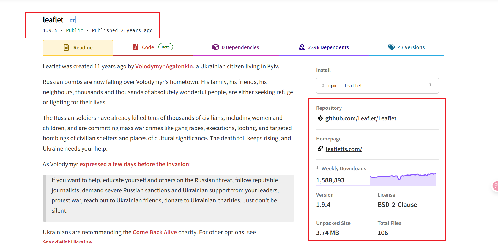

# 简介

Leaflet 是一个轻量级、易上手、插件丰富、移动端友好、开源免费的 JavaScript 库，非常适合快速构建交互式地图应用。它拥有 42KB 的极小体积，并支持 IE9+、iOS/Android 老设备。

## Leaflet 1.9.4

- [Leaflet 1.9.4 中文网](https://leafletjs.cn)
- [Leaflet 1.9.4 中文网 GitHub 地址](https://github.com/NICEXAI/leaflet_zh)
- [Leaflet 1.9.4 官网地址](https://leafletjs.com/)

## Leaflet 2.0.0-alpha

> - **2025 年 5 月 18 日** — Leaflet 2.0.0-alpha 版本已发布！
> - **注意：** 具体的 2.0 正式版本尚未发布，目前仍处于 Alpha 阶段。

- [Leaflet 2.0.0-alpha 官网 API 文档](https://leafletjs.com/reference-2.0.0.html)
- [Leaflet 2.0.0-alpha 更新内容详情](https://leafletjs.com/2025/05/18/leaflet-2.0.0-alpha.html)

经过两年半的努力，宣布 Leaflet 2.0 的第一个 Alpha 版本发布，标志着其底层现代化重构的重大进展。

## 核心变化

官方强调：2.0 版本不会破坏所有现有 API，其重点在于底层现代化重构，以提升性能、可维护性和开发体验。

### 1. 模块化导入方式的改变

- **从全局对象到 ES 模块导入：** 最大的变化之一是从依赖全局 `L` 对象转变为使用 ES 模块导入。这意味着你将不再直接访问 `L.Map` 或 `L.marker`，而是通过 `import { Map, marker } from 'leaflet';` 的方式来使用。
- **影响：** 这使得 Leaflet 更容易与现代前端构建工具（如 Webpack, Rollup, Vite）集成，支持 Tree Shaking，从而显著减小最终打包文件的大小。

### 2. 构造函数和选项对象的标准化

- **统一的选项对象：** 许多构造函数（如 `L.Map`, `L.Marker`, `L.TileLayer` 等）将更倾向于接受一个统一的选项对象作为参数，而不是多个位置参数。这使得 API 更具可读性和可扩展性。
- **示例（假设）：**
  - 旧版：
  ```js
  L.map("mapid", { zoomControl: false, center: [51.505, -0.09], zoom: 13 });
  ```
  - 新版：
  ```js
  new Map("mapid", { zoomControl: false, center: [51.505, -0.09], zoom: 13 });
  ```

### 3. 事件系统和异步操作的改进

- 可能会引入更细粒度的事件，并对异步操作（如加载数据、动画完成）提供 Promise 或 `async/await` 支持，以简化异步编程和提供更精确的控制。

### 4. 废弃和移除旧有 API

- 为了保持库的精简和现代化，一些在 1.x 版本中已被标记为“不推荐使用”（deprecated）的 API 可能会被彻底移除。

### 5. TypeScript 类型定义的增强

- 预计将提供更完善、更准确的内置 TypeScript 类型定义，为 TypeScript 用户提供更好的开发体验，包括自动补全和类型检查。

## 总结

目前 Leaflet 的稳定版本依旧为 1.9.4。然而，2.0 及未来版本代表着 Leaflet 的发展趋势，将带来更现代化、高性能和易于维护的地图开发体验。


