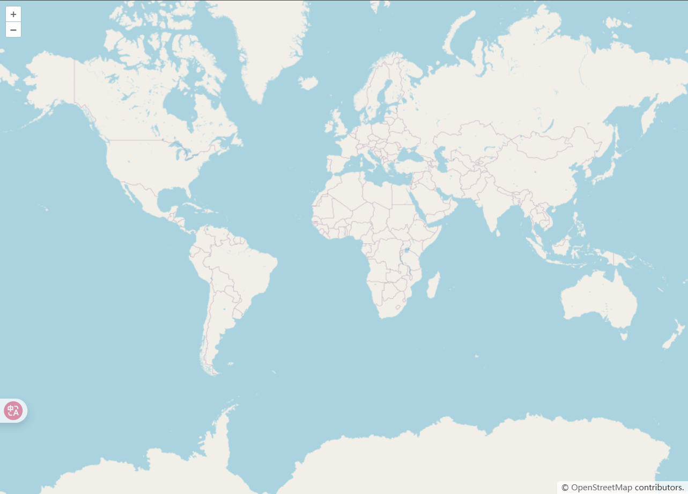
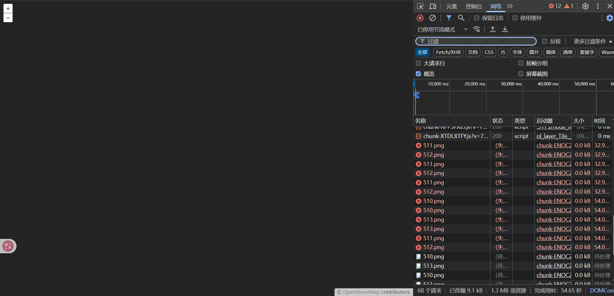
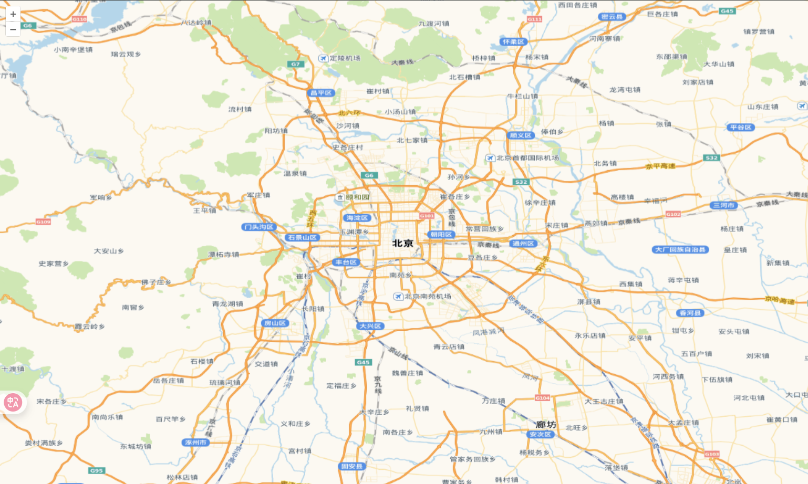

# 快速开始

## 技术栈

```bash
Vue 3.5.13
OpenLayers 10.5.0
```

## 初始化项目

```bash
# 创建vue项目 npm 7+，需要添加额外的 --
npm create vite@latest my-vue-ol -- --template vue

# 安装 OpenLayers
npm install ol --save
```

## 默认底图服务

1. Openlayers 需要一个容器来渲染地图，我们可以使用 Vue 的 `ref` 来获取这个容器。
2. Openlayers 采用 ES6 模块化的方式引入 OpenLayers 的相关类。
3. 注意点：默认 OSM 底图服务为外网服务，会受到网络限制，建议在国内使用时选择其他瓦片服务
4. 承载地图的容器，注意宽高一定要有，否则不显示

```vue
<template>
  <div ref="mapContainer" id="map"></div>
</template>

<script setup>
import { ref, onMounted } from "vue";
import Map from "ol/Map.js";
import OSM from "ol/source/OSM.js";
import TileLayer from "ol/layer/Tile.js";
import View from "ol/View.js";
import "ol/ol.css";
const mapContainer = ref(null);
let map = null;
onMounted(() => {
  initMap();
});
const initMap = () => {
  map = new Map({
    target: mapContainer.value,
    layers: [
      new TileLayer({
        source: new OSM(), // 官方使用OpenStreetMap作为底图
      }),
    ],
    view: new View({
      center: [0, 0],
      zoom: 2,
    }),
  });
};
</script>
<style scoped>
#map {
  position: absolute;
  top: 0;
  bottom: 0;
  width: 100vw;
  height: 100vh;
}
</style>
```

### 效果图



### 访问受限



## 国内底图服务

这里使用了高德地图和天地图作为底图服务，注意替换天地图的 API Key。[申请地址](http://lbs.tianditu.gov.cn/home.html)

```vue
<template>
  <div ref="mapContainer" id="map"></div>
</template>

<script setup>
import { ref, onMounted } from "vue";
import Map from "ol/Map.js";
import XYZ from "ol/source/XYZ.js";
import TileLayer from "ol/layer/Tile.js";
import View from "ol/View.js";
import "ol/ol.css";
const mapContainer = ref(null);
let map = null;
onMounted(() => {
  initMap();
});
const initMap = () => {
  map = new Map({
    target: mapContainer.value,
    layers: [
      new TileLayer({
        // 设置高德地图为数据源底图
        source: new XYZ({
          // 高德地图瓦片服务地址
          // url: "https://webst01.is.autonavi.com/appmaptile?lang=zh_cn&size=1&scale=1&style=6&x={x}&y={y}&z={z}",
          // 设置路网图层
          url: "https://webrd04.is.autonavi.com/appmaptile?lang=zh_cn&size=1&scale=1&style=7&x={x}&y={y}&z={z}",
          // 设置天地图图层
          // url: "http://t0.tianditu.gov.cn/vec_w/wmts?SERVICE=WMTS&REQUEST=GetTile&VERSION=1.0.0&LAYER=vec&STYLE=default&TILEMATRIXSET=w&FORMAT=tiles&TILEMATRIX={z}&TILEROW={y}&TILECOL={x}&tk=token", // token替换为你的天地图API Key
        }),
      }),
    ],
    view: new View({
      center: [116.4074, 39.9042], // 北京市中心经纬度
      zoom: 10,
      projection: "EPSG:4326", // 默认使用球面墨卡托投影(EPSG:3857)，需要设置为WGS 84(EPSG:4326)经纬度
    }),
  });
};
</script>
<style scoped>
#map {
  position: absolute;
  top: 0;
  bottom: 0;
  width: 100%;
}
</style>
```

### 效果图


