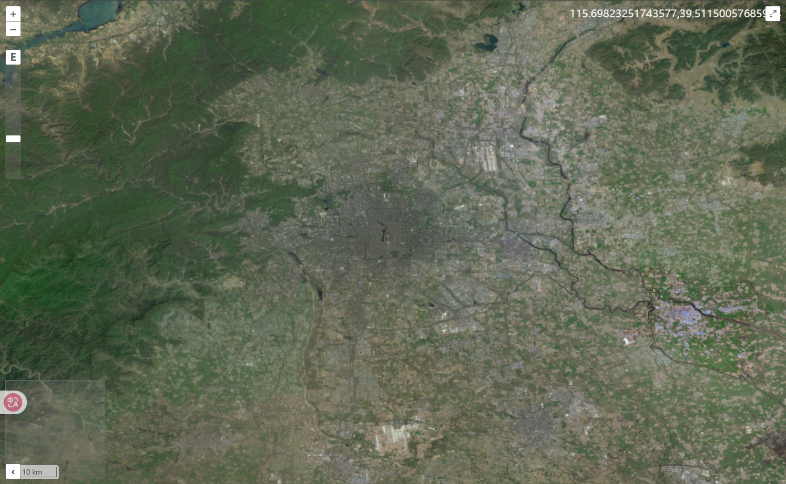
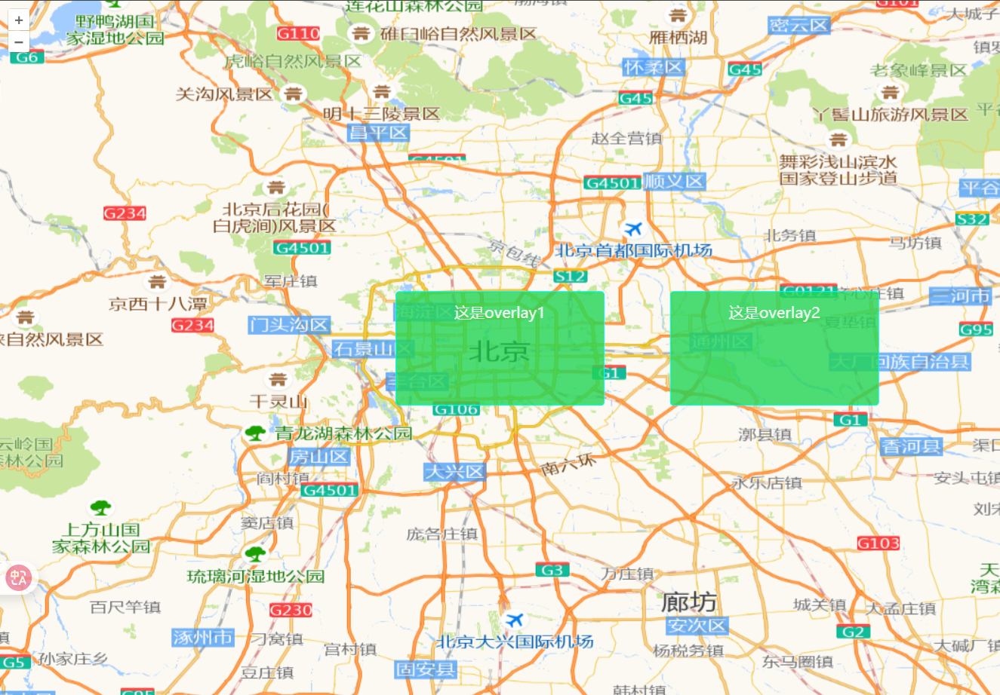
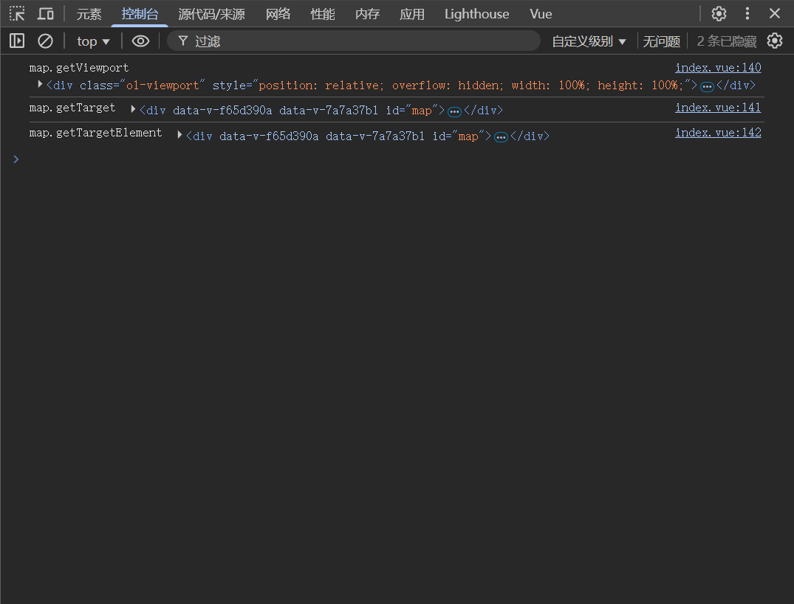
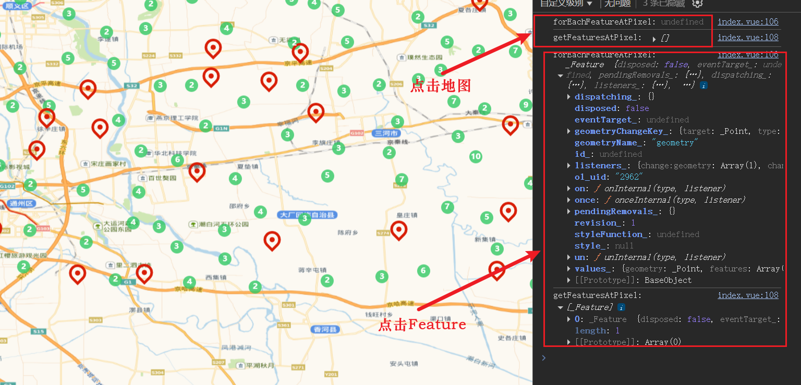

# Map 对象

Map（地图） - 容器核心，所有元素的顶级容器，管理图层、控件和交互

```js
import Map from "ol/Map.js";

// 创建地图对象
new Map(options);
```

## Map 对象

options 配置项有以下属性，接下来会详细说明用法：

| 名称                | 类型                | 描述                                   |
| ------------------- | ------------------- | -------------------------------------- |
| target              | string、HTMLElement | 地图容器的 DOM 元素或其 ID             |
| layers              | Array               | 地图图层数组                           |
| view                | View                | 地图视图对象                           |
| controls            | Array               | 地图控件数组                           |
| interactions        | Array               | 地图交互数组                           |
| pixelRatio          | number              | 像素比率，默认 window.devicePixelRatio |
| keyboardEventTarget | string、HTMLElement | 键盘事件目标，默认为 "document"        |
| overlays            | Array               | 地图覆盖物数组                         |
| maxTilesLoading     | number              | 最大同时加载的瓦片数量，默认为 16      |
| moveTolerance       | number              | 移动容忍度，默认为 1 像素              |

### target

指定地图渲染的 DOM 容器,必需属性，没有它地图无法渲染,容器必须有明确的宽度和高度

```vue
<template>
  <div ref="mapContainer" class="map-view"></div>
</template>

<script setup>
import { ref, onMounted } from "vue";
import Map from "ol/Map";

const mapContainer = ref(null);
const map = ref(null);

onMounted(() => {
  map.value = new Map({
    target: mapContainer.value, // 使用ref获取DOM元素
    // 其他配置...
  });
});
</script>

<style>
.map-view {
  width: 100%;
  height: 500px;
}
</style>
```

### layers

初始化地图图层,图层顺序决定绘制顺序,可通过 `map.addLayer()`动态添加,更多介绍参考[layer 对象](./03_layer对象.md)

```js
import TileLayer from "ol/layer/Tile";
import OSM from "ol/source/OSM";

const osmLayer = new TileLayer({
  source: new OSM(),
});

const osmLayer2 = new TileLayer({
  source: new OSM(), // 可以使用不同的源或配置
});

new Map({
  layers: [osmLayer, osmLayer2], // 添加多个图层
  // 其他配置...
});
```

### view

地图视图对象，控制地图的中心点、缩放级别、旋转角度等属性,更多介绍参考[view 对象](./05_view对象.md)

```js
import View from "ol/View";

const view = new View({
  center: [116.4074, 39.9042], // 初始中心
  zoom: 10, // 初始缩放
  projection: "EPSG:3857", // 坐标系
  minZoom: 3, // 最小缩放
  maxZoom: 18, // 最大缩放
  rotation: Math.PI / 4, // 旋转角度(弧度)
});
new Map({
  view: view, // 设置地图视图
  // 其他配置...
});
```

### controls

- 地图控件数组,默认包含缩放、旋转、全屏等控件。更多介绍参考[controls 对象](./06_controls对象.md)。
- `new Map({ controls: [] })`禁用所有控件。
- OpenLayers 为承载控件的各个 DOM 元素都自动设置了类名，所以通过 CSS 的类选择符就可以修改指定的控件样式。

#### 控件类型

| 控件类型      | 描述                             |
| ------------- | -------------------------------- |
| Zoom          | 缩放控件                         |
| Rotate        | 旋转控件，alt+shift+左键旋转地图 |
| FullScreen    | 全屏控件                         |
| Attribution   | 版权信息控件                     |
| ScaleLine     | 比例尺控件                       |
| MousePosition | 鼠标位置控件                     |
| OverviewMap   | 概览图控件                       |
| ZoomSlider    | 滑动缩放控件                     |
| ZoomToExtent  | 缩放到范围控件                   |

```js
import Zoom from "ol/control/Zoom.js";
import ScaleLine from "ol/control/ScaleLine.js";
import FullScreen from "ol/control/FullScreen.js";
import MousePosition from "ol/control/MousePosition.js";
import Rotate from "ol/control/Rotate.js";
import Attribution from "ol/control/Attribution.js";
import OverviewMap from "ol/control/OverviewMap.js";
import ZoomSlider from "ol/control/ZoomSlider.js";
import ZoomToExtent from "ol/control/ZoomToExtent.js";

new Map({
  controls: [
    new Zoom(), // 添加缩放控件
    new ScaleLine(), // 添加比例尺控件
    new FullScreen(), // 添加全屏控件
    new MousePosition(), // 添加鼠标位置控件
    new Rotate(), // 添加旋转控件
    new Attribution(), // 添加版权信息控件
    new OverviewMap(), // 添加概览图控件
    new ZoomSlider(), // 添加缩放滑块控件
    new ZoomToExtent({
      // 添加缩放到范围控件
      extent: [12667718, 2562800, 12718359, 2597725], // 前两个元素表示位置矩形的左下角坐标，后两个元素表示位置矩形的右上角坐标
    }),
  ],
  // 其他配置...
});
```



### interactions

- 地图交互数组,默认包含缩放、平移等交互。
- `new Map({ interactions: [] })`禁用所有交互。

#### 交互类型

| 交互类型           | 描述         |
| ------------------ | ------------ |
| MouseWheelZoom     | 鼠标滚轮缩放 |
| DoubleClickZoom    | 双击缩放     |
| KeyboardPan        | 键盘平移     |
| KeyboardZoom       | 键盘缩放     |
| DblClickDragZoom   | 双击拖动缩放 |
| DragAndDrop        | 拖放交互     |
| Link               | 链接交互     |
| PointerInteraction | 鼠标指针交互 |
| Select             | 选择交互     |

这里讲解一下基本使用，基本使用很简单，更多`interaction`介绍参考[interaction 对象](./07_interaction对象.md)。

```js
import DblClickDragZoom from "ol/interaction/DblClickDragZoom.js";
import DragPan from "ol/interaction/DragPan.js";
import DoubleClickZoom from "ol/interaction/DoubleClickZoom.js";

new Map({
  interactions: [new DblClickDragZoom(), new DragPan(), new DoubleClickZoom()],
});
```

### overlays

- 地图覆盖物数组,用于显示标记、弹出框等覆盖物。
- 如有不清楚属性，可参考[overlay](https://openlayers.org/en/latest/apidoc/module-ol_Overlay-Overlay.html)。

#### 属性

| 属性        | 描述                         |
| ----------- | ---------------------------- |
| id          | 覆盖物的唯一标识符           |
| element     | 覆盖物的 DOM 元素            |
| position    | 覆盖物的位置坐标             |
| offset      | 覆盖物的偏移量               |
| positioning | 覆盖物的定位方式             |
| stopEvent   | 是否阻止事件冒泡             |
| insertFirst | 是否将覆盖物插入到第一个位置 |
| className   | 覆盖物的 CSS 类名            |
| autoPan     | 是否自动平移地图以显示覆盖物 |

#### 示例

::: details 展开查看代码

```vue
<template>
  <div ref="mapContainer" id="map"></div>
  <div ref="overlay" class="overlay">这是overlay1</div>
  <div ref="overlay2" class="overlay">这是overlay2</div>
</template>

<script setup>
import { ref, onMounted } from "vue";
import Map from "ol/Map.js";
import XYZ from "ol/source/XYZ.js";
import TileLayer from "ol/layer/Tile.js";
import View from "ol/View.js";
import "ol/ol.css";

import Overlay from "ol/Overlay.js";

const mapContainer = ref(null);
const overlay = ref(null);
const overlay2 = ref(null);
let map = null;
onMounted(() => {
  initMap();
});
const initMap = () => {
  map = new Map({
    target: mapContainer.value,
    layers: [
      new TileLayer({
        // 设置高德地图为数据源底图
        source: new XYZ({
          // 矢量图（含路网、含注记）
          url: "http://wprd0{1-4}.is.autonavi.com/appmaptile?x={x}&y={y}&z={z}&lang=zh_cn&size=1&scl=1&style=7 ",
        }),
      }),
    ],
    view: new View({
      center: [116.4074, 39.9042], // 北京市中心经纬度
      zoom: 10,
      projection: "EPSG:4326", // 默认使用球面墨卡托投影(EPSG:3857)，需要设置为WGS 84(EPSG:4326)经纬度
    }),
    overlays: [
      new Overlay({
        id: "overlay1",
        element: overlay.value, // HTML元素
        position: [116.4074, 39.9042], // 设置overlay位置为北京市中心经纬度
        offset: [0, 0], // 设置overlay偏移量
        positioning: "center-center", // 设置overlay位置对齐方式
        stopEvent: false, // 设置为false可以使overlay不阻止事件传播
        autoPan: true, // 自动平移地图以显示overlay
      }),
      new Overlay({
        id: "overlay2",
        element: overlay2.value, // HTML元素
        position: [116.8074, 39.9042], // 设置overlay位置为北京市中心经纬度
        offset: [0, 0], // 设置overlay偏移量
        positioning: "center-center", // 设置overlay位置对齐方式
        stopEvent: false, // 设置为false可以使overlay不阻止事件传播
        autoPan: true, // 自动平移地图以显示overlay
      }),
    ],
  });
};
</script>
<style scoped>
#map {
  position: absolute;
  top: 0;
  bottom: 0;
  width: 100%;
}
.overlay {
  width: 200px;
  height: 100px;
  background: rgba(34, 212, 85, 0.8);
  padding: 10px;
  border: 1px solid aqua;
  border-radius: 4px;
}
</style>
```

:::



#### 常用方法

`getElement()`：获取覆盖物的 DOM 元素

`setElement(element)`：设置覆盖物的 DOM 元素

`getId()`：获取覆盖物的唯一标识符

`getPosition()`：获取覆盖物的位置坐标

`setPosition(position)`：设置覆盖物的位置坐标

`getOffset()`：获取覆盖物的偏移量

`setOffset(offset)`：设置覆盖物的偏移量

### Map 常用方法

`on(type, listener)`：添加事件监听器

`once(type, listener)`：添加一次性事件监听器

`un(type, listener)`：移除事件监听器

`addControl(control)`：添加控件到地图

`removeControl(control)`：从地图中移除控件

`addInteraction(interaction)`：添加交互到地图

`removeInteraction(interaction)`：从地图中移除交互

`addLayer(layer)`：添加图层到地图

`removeLayer(layer)`：从地图中移除图层

`setLayers(layers)`：清除现有图层并将图层添加到地图

`addOverlay(overlay)`：添加覆盖物到地图

`removeOverlay(overlay)`：从地图中移除覆盖物

`getOverlays()`：获取地图上的所有覆盖物

`getOverlayById(id)`：根据 ID 获取覆盖物

`getProperties()`：获取地图的属性

`getSize()`：获取地图容器的大小

`setSize(size)`：设置地图容器的大小

`updateSize()`：更新地图容器的大小

`getTarget()`：获取地图容器的 DOM 元素或其 ID

`getTargetElement()`：获取地图容器的 DOM 元素，与 getTarget 不同，此方法始终返回一个 Element ，如果地图没有目标，则返回 null

`getViewport()`：获取地图的视口元素

```js
console.log("map.getViewport", map.getViewport());
console.log("map.getTarget", map.getTarget());
console.log("map.getTargetElement", map.getTargetElement());
```


`getView()`：获取地图的视图对象

`setView(view)`：设置地图的视图对象

`getEventPixel(event)`：返回相对于视口的浏览器事件地图像素位置

`hasFeatureAtPixel(pixel)`：判断指定像素位置是否有要素

`render()`：重新渲染地图（在下一个动画帧）

`renderSync()`：同步渲染地图

`dispose()`：销毁地图实例，释放资源

`getPixelFromCoordinate(coordinate)`：根据经纬度坐标获取像素位置

`getEventCoordinate(event)`：根据事件获取经纬度坐标

`forEachFeatureAtPixel(pixel, callback)`：屏幕坐标获取要素

`getFeaturesAtPixel(pixel)`：屏幕坐标获取要素

```js
map.on("click", (event) => {
  const forEachFeatureAtPixel = map.forEachFeatureAtPixel(
    event.pixel,
    (feature) => {
      return feature; // 点击的要素
    }
  );
  console.log("forEachFeatureAtPixel:", forEachFeatureAtPixel);
  const getFeaturesAtPixel = map.getFeaturesAtPixel(event.pixel);
  console.log("getFeaturesAtPixel:", getFeaturesAtPixel);
});
```


