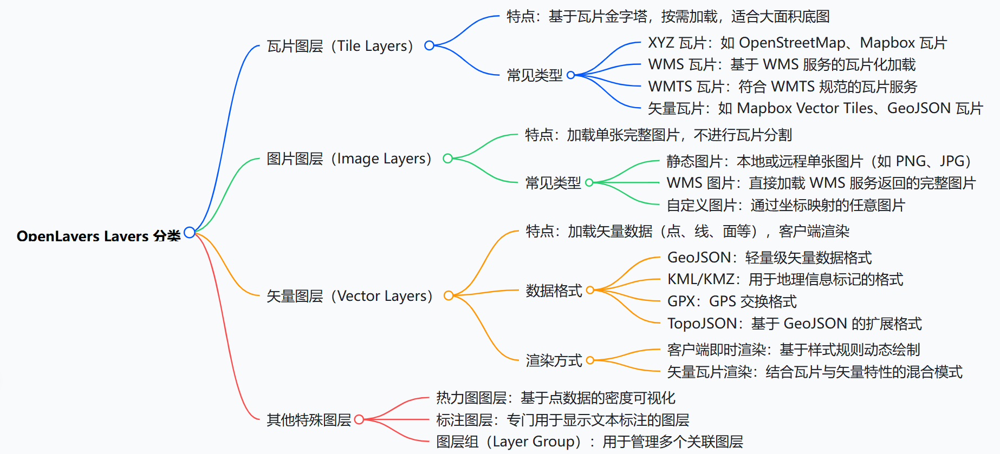
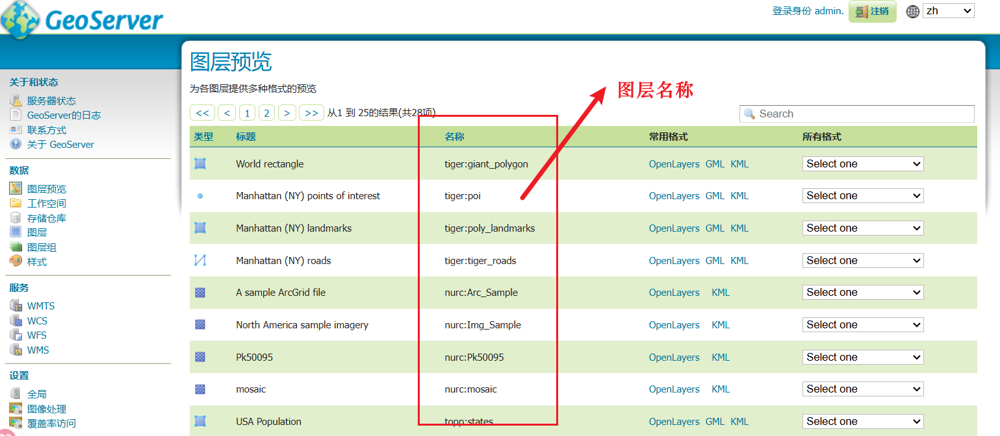
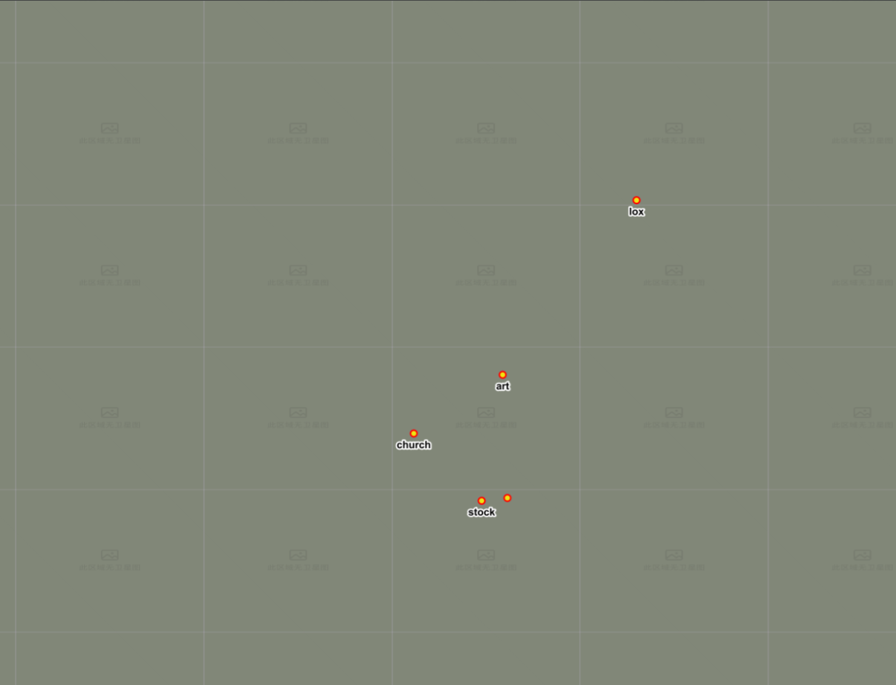
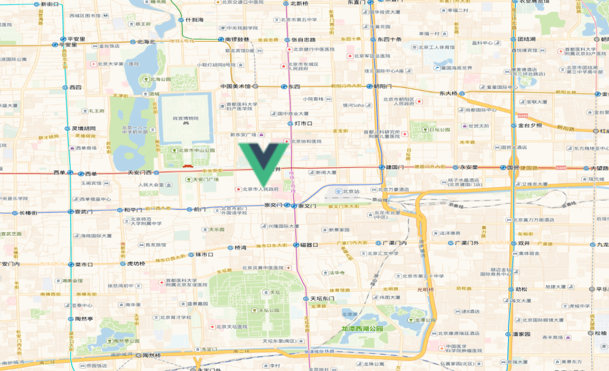
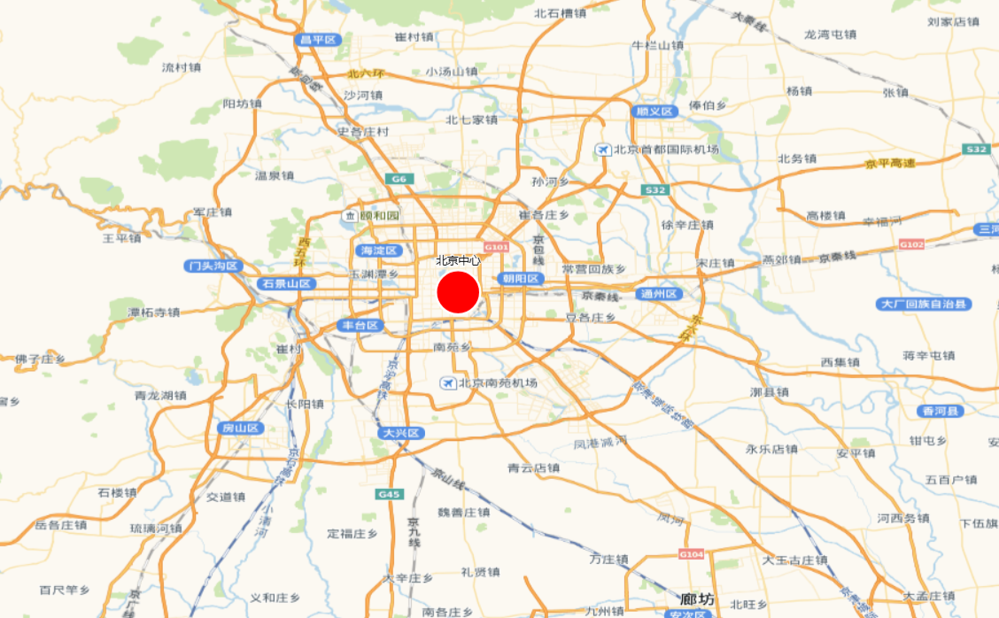
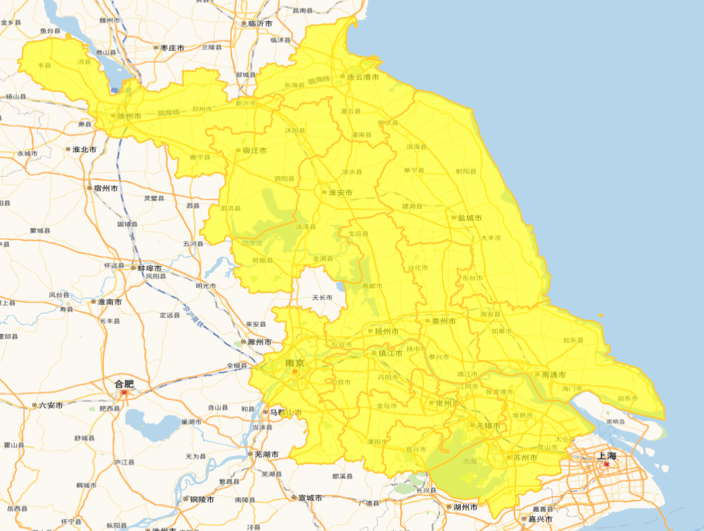
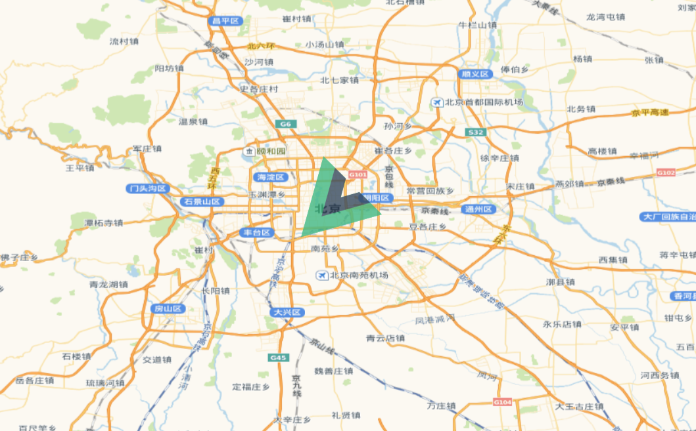
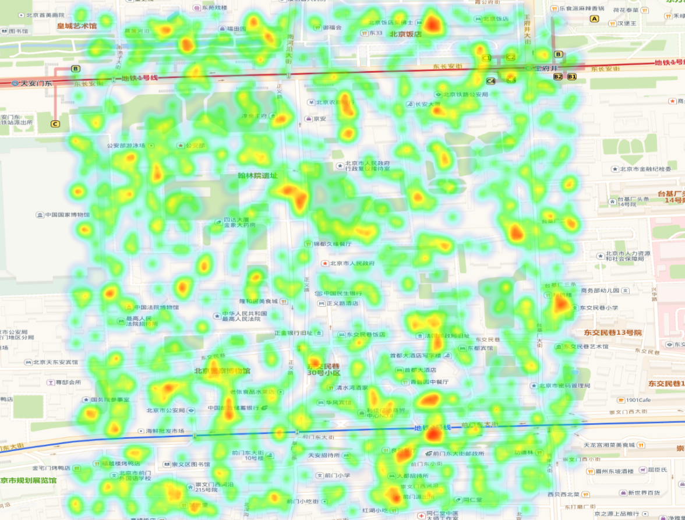

# Layer 对象

OpenLayers 中的图层(Layers)是地图数据可视化的核心组件，定义了数据如何被渲染和显示。结合 Source、Style 等灵活配置，它们构成了地图的基本元素。



## 常见图层类型

| 图层类型          | 类名                  | 说明                       |
| ----------------- | --------------------- | -------------------------- |
| TileLayer(重要)   | `ol/layer/Tile`       | 瓦片图层，常用于底图       |
| ImageLayer        | `ol/layer/Image`      | 单张图片图层               |
| VectorLayer(重要) | `ol/layer/Vector`     | 矢量要素图层               |
| VectorTileLayer   | `ol/layer/VectorTile` | 矢量瓦片图层               |
| HeatmapLayer      | `ol/layer/Heatmap`    | 热力图层                   |
| GroupLayer        | `ol/layer/Group`      | 图层组，可嵌套管理多个图层 |

## 核心公共属性

| 属性名        | 类型         | 默认值     | 描述                                           |
| ------------- | ------------ | ---------- | ---------------------------------------------- |
| source        | ol.source.\* | undefined  | 图层的数据源（必需）                           |
| opacity       | number       | 1          | 图层透明度（0-1）                              |
| visible       | boolean      | true       | 图层是否可见                                   |
| extent        | Array        | undefined  | 图层渲染的边界范围（[minx, miny, maxx, maxy]） |
| zIndex        | number       | 0          | 图层叠加顺序（值越大显示在越上层）             |
| minResolution | number       | undefined  | 图层可见的最小分辨率（小于此值不显示）         |
| maxResolution | number       | undefined  | 图层可见的最大分辨率（大于此值不显示）         |
| minZoom       | number       | undefined  | 图层可见的最小缩放级别                         |
| maxZoom       | number       | undefined  | 图层可见的最大缩放级别                         |
| className     | string       | 'ol-layer' | 图层元素的 CSS 类名                            |
| properties    | Object       | {}         | 自定义属性（用于存储任意业务数据）             |

```js
const layer = new ol.layer.Tile({
  source: new ol.source.OSM(), // 数据源
  opacity: 0.5, // 透明度
  visible: false, // 可见性
  extent: [-180, -90, 180, 90], // 渲染范围
  zIndex: 100, // 叠加顺序
  minResolution: 0.00001, // 最小分辨率
  maxResolution: 0.0001, // 最大分辨率
  minZoom: 0, // 最小缩放级别
  maxZoom: 20, // 最大缩放级别
  className: "my-tile-layer", // CSS 类名
  properties: {
    customProperty: "custom value",
  }, // 自定义属性
});
```

## 核心公共方法

| 方法名                | 返回值       | 描述                             |
| --------------------- | ------------ | -------------------------------- |
| getOpacity()          | number       | 获取图层透明度                   |
| setOpacity(opacity)   | void         | 设置图层透明度                   |
| getVisible()          | boolean      | 获取图层可见性                   |
| setVisible(visible)   | void         | 设置图层可见性                   |
| getExtent()           | Array        | 获取图层范围                     |
| setExtent(extent)     | void         | 设置图层范围                     |
| getZIndex()           | number       | 获取图层叠加顺序                 |
| setZIndex(zindex)     | void         | 设置图层叠加顺序                 |
| getMinResolution()    | number       | 获取最小分辨率                   |
| setMinResolution(res) | void         | 设置最小分辨率（小于此值不显示） |
| getMaxResolution()    | number       | 获取最大分辨率                   |
| setMaxResolution(res) | void         | 设置最大分辨率（大于此值不显示） |
| getSource()           | ol.source.\* | 获取数据源                       |
| setSource(source)     | void         | 设置数据源                       |
| getProperties()       | Object       | 获取所有自定义属性               |
| set(key, value)       | void         | 设置自定义属性                   |
| get(key)              | any          | 获取自定义属性                   |

```js
const layer = new ol.layer.Tile({
  source: new ol.source.OSM(),
});

layer.getProperties(); // {customProperty: 'custom value'}

layer.getOpacity(); // 0.5

layer.getVisible(); // true
```

## 1. TileLayer - 瓦片图层

用于加载如 OSM、WMTS、高德、天地图等瓦片地图服务。

特有属性：
| 属性名 | 类型 | 默认值 | 描述 |
| ---------- | ------ | --------- | ------------ |
| background | string | undefined | 图层背景颜色 |

### TileSource - 数据源

`Layer`和`Source`不分家，每一个`Layer`都有一个`Source`，`Layer`负责数据的渲染，`Source`负责数据的获取，所以`Source`的大部分内容我都放在与`Layer`一起说明

瓦片图层数据源(Tile Source)负责提供瓦片地图的原始数据，定义了瓦片的获取方式、格式和加载策略。它是瓦片图层(TileLayer)的核心组成部分。

| 类型     | 介绍                    |
| -------- | ----------------------- |
| OSM      | 加载 OpenStreetMap 瓦片 |
| XYZ      | 加载标准 XYZ 格式瓦片   |
| WMTS     | 加载 OGC WMTS 服务瓦片  |
| WMS      | 加载 WMS 服务瓦片       |
| TMS      | 加载 TMS 格式瓦片       |
| BingMaps | 加载 Bing 地图瓦片      |

#### OSM

```js
// 加载 OpenStreetMap 瓦片
import TileLayer from "ol/layer/Tile";
import OSM from "ol/source/OSM";

const tileLayer = new TileLayer({
  source: new OSM({
    attributions: "© OpenStreetMap contributors",
    maxZoom: 19,
  }),
  opacity: 1, // 不透明度，0~1
  visible: true, // 是否可见
  zIndex: 0, // 图层顺序
});
```

#### XYZ

```js
// 加载高德地图
import TileLayer from "ol/layer/Tile";
import XYZ from "ol/source/XYZ";

const tileLayer = new TileLayer({
  source: new XYZ({
    url: "https://webrd04.is.autonavi.com/appmaptile?lang=zh_cn&size=1&scale=1&style=7&x={x}&y={y}&z={z}",
  }),
  opacity: 1, // 不透明度，0~1
  visible: true, // 是否可见
  zIndex: 0, // 图层顺序
});
```

#### WMS

```js
import TileLayer from "ol/layer/Tile.js";
import TileWMS from "ol/source/TileWMS.js";

// http://localhost:8520/geoserver/tiger/wms?service=WMS&version=1.1.0&request=GetMap&layers=tiger%3Apoi&bbox=-74.0118315772888%2C40.70754683896324%2C-74.00153046439813%2C40.719885123828675&width=641&height=768&srs=EPSG%3A4326&styles=&format=application/openlayers
const wmsLayer = new TileLayer({
  source: new TileWMS({
    url: "http://localhost:8520/geoserver/tiger/wms",
    params: {
      LAYERS: "tiger:poi",
      VERSION: "1.1.0",
    },
  }),
});
map.addLayer(wmsLayer);
```





---

## 2. ImageLayer - 图片图层

用于加载单张图片或 WMS 服务。

### ImageSource - 数据源

ImageLayer 使用单一图像覆盖整个地图视图范围，其数据源负责获取和生成这张图像

| 类型            | 介绍                      |
| --------------- | ------------------------- |
| ImageStatic     | 加载静态图像              |
| ImageWMS        | 加载 WMS 服务图像         |
| ImageArcGISRest | 加载 ArcGIS Rest 服务图像 |

#### ImageStatic - 静态图像

```js
import ImageLayer from "ol/layer/Image";
import Static from "ol/source/ImageStatic.js";

const imageLayer = new ImageLayer({
  source: new Static({
    url: "/src/assets/vue.svg", // 替换为你的图片路径
    imageExtent: [116.4074, 39.9042, 116.4174, 39.9142], // 图像在地图坐标中的范围
  }),
});
map.addLayer(imageLayer);
```



---

## 3. VectorLayer - 矢量图层

用于显示点、线、面等地理要素。直接在客户端渲染矢量数据，支持 GeoJSON、KML 等格式，动态修改要素和样式

特有属性：

| 属性名        | 类型           | 默认值    | 描述         |
| ------------- | -------------- | --------- | ------------ |
| background    | string         | undefined | 图层背景颜色 |
| style（重要） | ol.style.Style | undefined | 矢量要素样式 |

### VectorSource - 数据源

矢量图层数据源(Vector Source)负责提供矢量数据，定义了数据的获取方式、格式和加载策略。它是矢量图层(VectorLayer)的核心组成部分。

| 类型    | 介绍                      |
| ------- | ------------------------- |
| GeoJSON | 加载 GeoJSON 格式矢量数据 |
| KML     | 加载 KML 格式矢量数据     |
| Vector  | 加载矢量要素              |

#### 核心属性

- 加载矢量数据：Feature -> VectorSource（features 属性加载） -> VectorLayer
- 加载空间数据（GeoJson 等）：VectorSource（url 属性加载） -> VectorLayer

| 属性名          | 类型              | 默认值 | 描述                                            |
| --------------- | ----------------- | ------ | ----------------------------------------------- |
| features        | Array             | []     | 数据源中的要素数组                              |
| url             | string            | null   | 数据源的 URL（用于远程加载）                    |
| format          | ol.format.Feature | null   | 数据解析格式（如 GeoJSON、KML 等）              |
| loader          | function          | null   | 自定义加载函数                                  |
| strategy        | function          | all    | 加载策略（控制何时加载数据）                    |
| overlaps        | boolean           | true   | 要素是否允许重叠（设置为 false 可优化渲染性能） |
| useSpatialIndex | boolean           | true   | 是否使用空间索引（对于频繁交互的场景建议开启）  |
| wrapX           | boolean           | true   | 是否在水平方向重复要素（适用于全球地图）        |

#### 核心方法

| 方法名                                    | 返回值  | 描述                                   |
| ----------------------------------------- | ------- | -------------------------------------- |
| addFeature(feature)                       | void    | 添加单个要素                           |
| addFeatures(features)                     | void    | 添加多个要素                           |
| removeFeature(feature)                    | Feature | 移除单个要素（返回被移除的要素）       |
| removeFeatures(features)                  | void    | 移除多个要素                           |
| getFeatureById(id)                        | Feature | 根据 ID 获取要素                       |
| getFeatures()                             | Array   | 获取所有要素                           |
| getFeaturesInExtent(extent)               | Array   | 获取指定范围内的要素（需开启空间索引） |
| getClosestFeatureToCoordinate(coordinate) | Feature | 根据坐标获取最近要素                   |
| forEachFeature(callback)                  | void    | 遍历所有要素                           |
| forEachFeatureInExtent(extent, callback)  | void    | 在指定范围内遍历要素（需开启空间索引） |
| clear()                                   | void    | 清除所有要素                           |

##### 矢量要素创建

- 以下为创建一个最基础的矢量要素（点），更多矢量图层属性参考[矢量图形](./08_常见矢量图形.md)，
- 创建顺序为`Feature -> VectorSource（features 属性加载） -> VectorLayer`
- 下例代码中`Style`,我们接下来会讲解其属性

```js
import Feature from "ol/Feature.js";
import Point from "ol/geom/Point.js";
import VectorLayer from "ol/layer/Vector.js";
import VectorSource from "ol/source/Vector.js";
import Style from "ol/style/Style";
import Fill from "ol/style/Fill";
import Stroke from "ol/style/Stroke";
import CircleStyle from "ol/style/Circle";
import Text from "ol/style/Text";

const feature = new Feature({
  geometry: new Point([116.4074, 39.9042]), // 北京市中心经纬度
  name: "北京中心",
});
const source = new VectorSource({
  features: [feature],
});
const layer = new VectorLayer({
  source: source,
  // 圆形标记
  style: new Style({
    image: new CircleStyle({
      radius: 20,
      fill: new Fill({ color: "red" }),
      stroke: new Stroke({ color: "white", width: 2 }),
    }),
    text: new Text({
      text: feature.get("name"), // 显示点的名称
      offsetY: -28, // 文本偏移
      fill: new Fill({ color: "black" }),
      stroke: new Stroke({ color: "white", width: 2 }),
    }),
  }),
});
map.addLayer(layer);
```



##### 加载 Geojson

- 创建顺序为`VectorSource（url 属性加载） -> VectorLayer`
- format：数据解析格式，用于将 GeoJSON 数据转换为 OpenLayers 中的要素对象。

```js
import GeoJSON from "ol/format/GeoJSON.js";
import VectorLayer from "ol/layer/Vector.js";
import VectorSource from "ol/source/Vector.js";
import Style from "ol/style/Style";
import Fill from "ol/style/Fill";
import Stroke from "ol/style/Stroke";

const geojsonLayer = new VectorLayer({
  source: new VectorSource({
    url: "https://geo.datav.aliyun.com/areas_v3/bound/320000_full.json", // 替换为你的GeoJSON数据URL
    format: new GeoJSON(), // 数据解析格式
  }),
  style: new Style({
    fill: new Fill({
      color: "rgba(255, 255, 0, 0.6)",
    }),
    stroke: new Stroke({
      color: "#ffcc33",
      width: 2,
    }),
  }),
});
map.addLayer(geojsonLayer);
```



### Style - 样式

样式系统用于控制矢量要素（点、线、面）的视觉呈现

| 组件名       | 导入路径              | 描述                           |
| ------------ | --------------------- | ------------------------------ |
| Style        | ol/style/Style        | 样式容器，组合其他样式组件     |
| Fill         | ol/style/Fill         | 填充样式（用于面要素）         |
| Stroke       | ol/style/Stroke       | 描边样式（用于线和面的边界）   |
| Text         | ol/style/Text         | 文本标注样式                   |
| Icon         | ol/style/Icon         | 图标样式（用于点要素）         |
| Circle       | ol/style/Circle       | 圆形样式（用于点要素）         |
| RegularShape | ol/style/RegularShape | 规则形状样式（三角形、星形等） |

#### 基本样式

常用配置在代码中都已经添加，比较简单，就不单独提取模块说明了

```js
import { Style, Fill, Stroke, Circle, Text } from "ol/style";

// 点要素样式
const pointStyle = new Style({
  image: new Circle({
    radius: 10, // 半径
    fill: new Fill({ color: "red" }), // 填充颜色
  }),
  text: new Text({
    text: "标记点", // 文本内容
    font: "bold 14px sans-serif", // 字体样式
    fill: new Fill({ color: "black" }), // 文本填充颜色
    offsetY: -20, // 文本垂直偏移
    stroke: new Stroke({
      color: "white", // 文本描边颜色
      width: 2, // 文本描边宽度
    }),
    rotation: Math.PI / 4, // 文本旋转角度（弧度）
  }),
});

// 线要素样式
const lineStyle = new Style({
  stroke: new Stroke({
    color: "blue",
    width: 3,
    lineDash: [10, 5], // 虚线模式
  }),
});

// 面要素样式
const polygonStyle = new Style({
  fill: new Fill({
    color: "rgba(0, 255, 0, 0.3)", // 带透明度的绿色
  }),
  stroke: new Stroke({
    color: "green",
    width: 2,
  }),
});
```

#### 动态样式

每次视图变化时都会重新计算样式，适用于需要根据视图状态调整样式的情况。

```js
// 设置动态样式函数
feature.setStyle((feature, resolution) => {
  const size = resolution < 100 ? 10 : 5;
  return new Style({
    image: new CircleStyle({
      radius: size,
      fill: new Fill({ color: "blue" }),
    }),
  });
});
```

#### 图标样式

```js
import { Style, Icon } from "ol/style";

const iconStyle = new Style({
  image: new Icon({
    src: "/src/assets/vue.svg", // 使用本地图片
    // scale: 1, // 缩放比例
    width: 60, // 图标的像素宽度,不能与 scale 一起使用。
    height: 60, // 图标的像素高度,不能与 scale 一起使用。
    rotation: Math.PI / 4, // 旋转角度（弧度）
    anchor: [0.5, 0.5], // 锚点位置（图标中心）
    opacity: 0.8, // 图标透明度
    rotateWithView: false, // 是否随视图旋转图标
  }),
});
```



---

## 4. VectorTileLayer - 矢量瓦片图层

用于加载如 Mapbox、GeoServer 发布的矢量瓦片。

```js
import VectorTileLayer from "ol/layer/VectorTile";
import VectorTileSource from "ol/source/VectorTile";
import MVT from "ol/format/MVT";

const vectorTileLayer = new VectorTileLayer({
  source: new VectorTileSource({
    format: new MVT(),
    url: "https://your-server/tiles/{z}/{x}/{y}.pbf",
  }),
});
```

---

## 5. HeatmapLayer - 热力图层

热力图是一种用颜色渐变来表现数据点密度或强度的可视化方式，特别适合展示大量点数据的分布情况。通过 `ol/layer/Heatmap` 类实现，它将点要素（Point）数据转换为连续的颜色渐变表面

特有属性：

| 属性名   | 类型             | 默认值                                   | 描述                                       |
| -------- | ---------------- | ---------------------------------------- | ------------------------------------------ |
| blur     | number           | 15                                       | 模糊半径（像素），控制热力点的扩散程度     |
| radius   | number           | 8                                        | 点半径（像素），控制热力点的初始大小       |
| gradient | Array            | ['#00f', '#0ff', '#0f0', '#ff0', '#f00'] | 颜色渐变数组，至少需两个颜色               |
| weight   | string\|function | 'weight'                                 | 权重字段名或计算函数（用于调整点的重要性） |

数据源必须包含点要素

```js
import Heatmap from "ol/layer/Heatmap";
import VectorSource from "ol/source/Vector";
import Feature from "ol/Feature";
import Point from "ol/geom/Point";

// 随机生成1000个点
const features = [];
for (let i = 0; i < 1000; i++) {
  const randomLon = 116.4074 + (Math.random() - 0.5) * 0.01; // 随机生成纬度
  const randomLat = 39.9042 + (Math.random() - 0.5) * 0.01; // 随机生成经度
  const feature = new Feature({
    geometry: new Point([randomLon, randomLat]),
  });
  features.push(feature);
}
// 创建一个矢量图层
const heatmapLayer = new Heatmap({
  source: new VectorSource({
    features,
  }),
});
map.addLayer(heatmapLayer);
```



---

## 6. GroupLayer - 图层组

GroupLayer（图层组）是 OpenLayers 中用于组织和管理多个图层的容器,对整个图层组进行统一控制

### 核心方法

| 方法名              | 描述                   |
| ------------------- | ---------------------- |
| getLayers()         | 获取组中的所有图层数组 |
| setLayers(layers)   | 设置组中的图层数组     |
| getVisible()        | 获取组的可见性         |
| setVisible(visible) | 设置组的可见性         |
| getOpacity()        | 获取组的透明度         |
| setOpacity(opacity) | 设置组的透明度         |
| getZIndex()         | 获取图层组叠放顺序     |
| setZIndex(zIndex)   | 设置图层组叠放顺序     |
| getExtent()         | 获取组的范围（范围）   |
| getMinResolution()  | 获取组的最小分辨率     |
| getMaxResolution()  | 获取组的最大分辨率     |
| getMinZoom()        | 获取组的最小缩放级别   |
| getMaxZoom()        | 获取组的最大缩放级别   |

```js
import LayerGroup from "ol/layer/Group";

const groupLayer = new LayerGroup({
  layers: [tileLayer, vectorLayer],
});
```

### 添加图层到组

```js
// 方法1：创建时添加
const group = new LayerGroup({
  layers: [layer1, layer2],
});

// 方法2：通过集合添加
group.getLayers().push(layer3);

// 方法3：插入指定位置
group.getLayers().insertAt(0, layer0); // 插入到首位

// 方法4：添加多个图层
group.getLayers().extend([layer4, layer5]);
```
