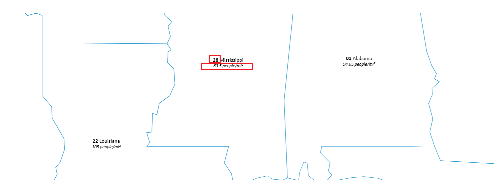

[地图中的标签使用不同的字体来创建清晰的上下文](https://openlayers.org/en/latest/examples/rich-text-labels.html)，一段文本，既有粗体，又有斜体

```js
style: function (feature) {
    labelStyle
      .getText()
      .setText([
        feature.getId(),
        'bold 13px Calibri,sans-serif',
        ` ${feature.get('name')}`,
        '',
        '\n',
        '',
        `${feature.get('density')} people/mi²`,
        'italic 11px Calibri,sans-serif',
      ]);
    return style;
  },
```


