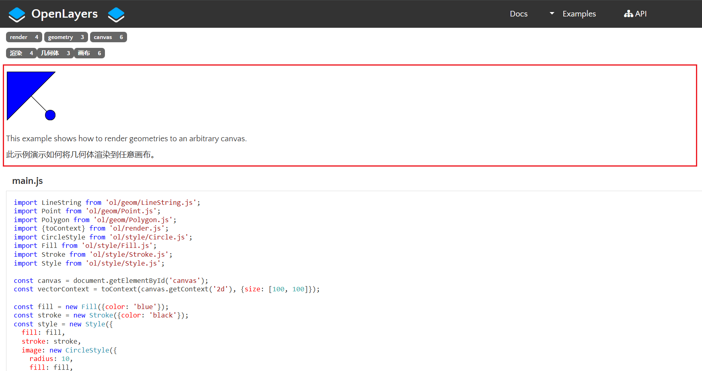

[将几何体渲染到画布](https://openlayers.org/en/latest/examples/render-geometry.html)，无需`map，layer`，创建一个`canvas`元素，将几何体渲染到canvas元素上

```js
import LineString from 'ol/geom/LineString.js';
import Point from 'ol/geom/Point.js';
import Polygon from 'ol/geom/Polygon.js';
import {toContext} from 'ol/render.js';
import CircleStyle from 'ol/style/Circle.js';
import Fill from 'ol/style/Fill.js';
import Stroke from 'ol/style/Stroke.js';
import Style from 'ol/style/Style.js';

const canvas = document.getElementById('canvas');
const vectorContext = toContext(canvas.getContext('2d'), {size: [100, 100]});

const fill = new Fill({color: 'blue'});
const stroke = new Stroke({color: 'black'});
const style = new Style({
  fill: fill,
  stroke: stroke,
  image: new CircleStyle({
    radius: 10,
    fill: fill,
    stroke: stroke,
  }),
});
vectorContext.setStyle(style);

vectorContext.drawGeometry(
  new LineString([
    [10, 10],
    [90, 90],
  ]),
);
vectorContext.drawGeometry(
  new Polygon([
    [
      [2, 2],
      [98, 2],
      [2, 98],
      [2, 2],
    ],
  ]),
);
vectorContext.drawGeometry(new Point([88, 88]));
```


