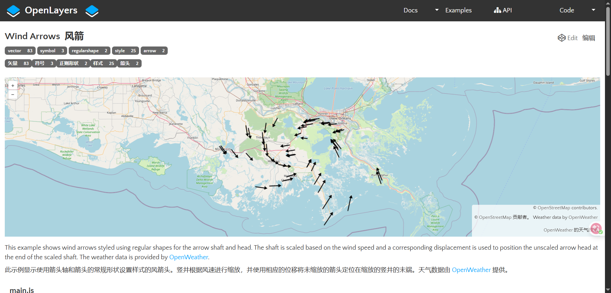

[风箭](https://openlayers.org/en/latest/examples/wind-arrows.html)，这个案例一般，主要看一下自定义箭头和角度计算，正常绘制风场还需要有**动画效果**，我在插件案例中介绍了一个好用的工具




## 核心代码

### 绘制风箭头

```js
const shaft = new RegularShape({
  points: 2,
  radius: 5,
  stroke: new Stroke({
    width: 2,
    color: "black",
  }),
  rotateWithView: true,
});

const head = new RegularShape({
  points: 3,
  radius: 5,
  fill: new Fill({
    color: "black",
  }),
  rotateWithView: true,
});

const styles = [new Style({ image: shaft }), new Style({ image: head })];
```

### 计算角度

```js
 style: function (feature) {
        const wind = feature.get('wind');
        // rotate arrow away from wind origin
        const angle = ((wind.deg - 180) * Math.PI) / 180;
        const scale = wind.speed / 10;
        shaft.setScale([1, scale]);
        shaft.setRotation(angle);
        head.setDisplacement([
          0,
          head.getRadius() / 2 + shaft.getRadius() * scale,
        ]);
        head.setRotation(angle);
        return styles;
      },
```

### 完整源码

我直接把官方代码做了转化，这里注意我使用的是`OSM`底图

:::details 展开代码

```vue
<template>
  <div class="map-container">
    <div ref="mapRef" class="map"></div>
  </div>
</template>

<script setup>
import { ref, onMounted, onUnmounted } from "vue";
import Feature from "ol/Feature.js";
import Map from "ol/Map.js";
import View from "ol/View.js";
import Point from "ol/geom/Point.js";
import TileLayer from "ol/layer/Tile.js";
import VectorLayer from "ol/layer/Vector.js";
import { fromLonLat } from "ol/proj.js";
import OSM from "ol/source/OSM.js";
import VectorSource from "ol/source/Vector.js";
import Fill from "ol/style/Fill.js";
import RegularShape from "ol/style/RegularShape.js";
import Stroke from "ol/style/Stroke.js";
import Style from "ol/style/Style.js";
import "ol/ol.css";

// 地图实例引用
let map = null;
// 地图容器引用
const mapRef = ref(null);

onMounted(async () => {
  // 创建风向箭头样式（箭头杆和箭头头）
  const shaft = new RegularShape({
    points: 2,
    radius: 5,
    stroke: new Stroke({
      width: 2,
      color: "black",
    }),
    rotateWithView: true,
  });

  const head = new RegularShape({
    points: 3,
    radius: 5,
    fill: new Fill({
      color: "black",
    }),
    rotateWithView: true,
  });

  const styles = [new Style({ image: shaft }), new Style({ image: head })];

  // 创建矢量数据源
  const source = new VectorSource({
    attributions: "Weather data by OpenWeather",
  });

  // 创建地图
  map = new Map({
    layers: [
      new TileLayer({
        source: new OSM(), // OpenStreetMap底图
      }),
      new VectorLayer({
        source: source,
        style: function (feature) {
          const wind = feature.get("wind");
          // 计算风向箭头角度（从风向旋转180度，指向风吹去的方向）
          const angle = ((wind.deg - 180) * Math.PI) / 180;
          // 根据风速计算箭头长度比例
          const scale = wind.speed / 10;

          // 设置箭头杆样式
          shaft.setScale([1, scale]);
          shaft.setRotation(angle);

          // 设置箭头头位置和旋转
          head.setDisplacement([
            0,
            head.getRadius() / 2 + shaft.getRadius() * scale,
          ]);
          head.setRotation(angle);

          return styles;
        },
      }),
    ],
    view: new View({
      center: [0, 0],
      zoom: 2,
    }),
  });

  // 设置地图容器并加载数据
  if (mapRef.value) {
    map.setTarget(mapRef.value);

    try {
      // 加载气象数据（注意：需要确保此路径下有对应的JSON文件）
      const response = await fetch("/src/openlayers/weather.json");
      const data = await response.json();

      // 创建气象数据要素
      const features = [];
      data.list.forEach(function (report) {
        // 创建点要素
        const feature = new Feature(
          new Point(fromLonLat([report.coord.lon, report.coord.lat]))
        );
        // 设置要素属性
        feature.setProperties(report);
        features.push(feature);
      });

      // 添加要素到数据源
      source.addFeatures(features);
      // 调整视图以适应数据范围
      map.getView().fit(source.getExtent());
    } catch (error) {
      console.error("加载气象数据时出错:", error);
      alert("无法加载气象数据，请检查文件路径是否正确");
    }
  }
});

onUnmounted(() => {
  // 组件卸载时清理地图实例
  if (map) {
    map.setTarget(null);
    map = null;
  }
});
</script>

<style scoped>
.map-container {
  width: 100vw;
  height: 100vh;
}

.map {
  width: 100%;
  height: 100%;
}
</style>
```

:::
