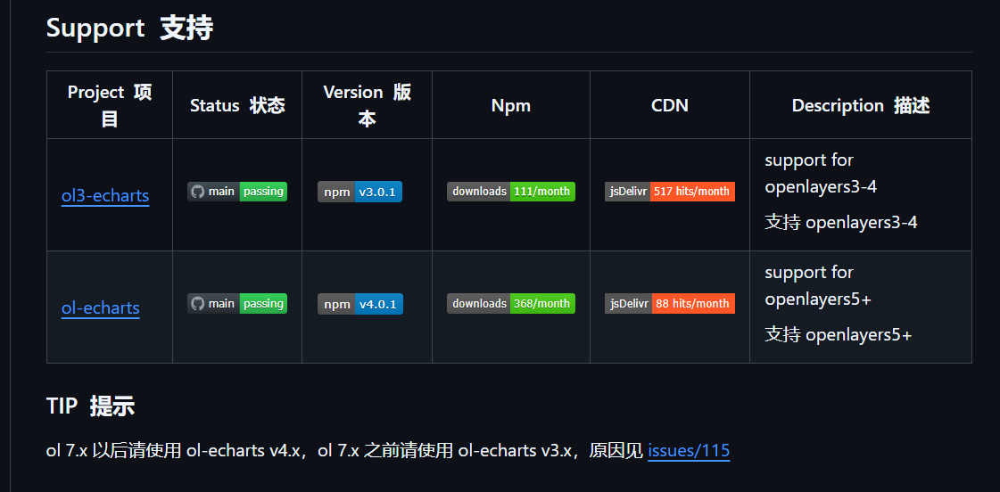

# ol-echarts 使用

插件地址：[ol-echarts](https://github.com/sakitam-fdd/ol3Echarts?tab=readme-ov-file)

`tips`:我这里是 openlayers10+,所以下载`ol-echarts`



## 实现思路

案例参考：[来源](https://blog.csdn.net/treasurecp/article/details/122221087)

```bash
# 安装依赖
npm install ol-echarts --save

npm install echarts --save
```

:::details 展开代码

```vue
<template>
  <div ref="mapContainer" id="map"></div>
</template>

<script setup>
import { ref, onMounted } from "vue";
import Map from "ol/Map.js";
import XYZ from "ol/source/XYZ.js";
import TileLayer from "ol/layer/Tile.js";
import View from "ol/View.js";
import "ol/ol.css";
import EChartsLayer from "ol-echarts";
const mapContainer = ref(null);
let map = null;
onMounted(() => {
  initMap();
});
const initMap = () => {
  map = new Map({
    target: mapContainer.value,
    controls: [], // 禁用默认控件
    layers: [
      new TileLayer({
        source: new XYZ({
          // 高德地图瓦片服务地址
          // url: "https://webst01.is.autonavi.com/appmaptile?lang=zh_cn&size=1&scale=1&style=6&x={x}&y={y}&z={z}",
          // 设置路网图层
          // url: "https://webrd04.is.autonavi.com/appmaptile?lang=zh_cn&size=1&scale=1&style=7&x={x}&y={y}&z={z}",

          // 矢量图（含路网、含注记）
          // url: "http://wprd0{1-4}.is.autonavi.com/appmaptile?x={x}&y={y}&z={z}&lang=zh_cn&size=1&scl=1&style=7 ",
          // 矢量图（含路网、不含注记）
          // url: 'http://wprd0{1-4}.is.autonavi.com/appmaptile?x={x}&y={y}&z={z}&lang=zh_cn&size=1&scl=2&style=7 '
          // 影像地图（不含路网、不含注记）
          // url: 'http://wprd0{1-4}.is.autonavi.com/appmaptile?x={x}&y={y}&z={z}&lang=zh_cn&size=1&scl=1&style=6 '
          // 影像地图（不含路网、不含注记）
          url: "http://wprd0{1-4}.is.autonavi.com/appmaptile?x={x}&y={y}&z={z}&lang=zh_cn&size=1&scl=2&style=6 ",
          // 影像路网（含路网、含注记）
          // url: 'http://wprd0{1-4}.is.autonavi.com/appmaptile?x={x}&y={y}&z={z}&lang=zh_cn&size=1&scl=1&style=8 '
          // 影像路网（含路网、不含注记）
          // url:'http://wprd0{1-4}.is.autonavi.com/appmaptile?x={x}&y={y}&z={z}&lang=zh_cn&size=1&scl=2&style=8 '

          // 设置天地图图层
          // url: "http://t0.tianditu.gov.cn/vec_w/wmts?SERVICE=WMTS&REQUEST=GetTile&VERSION=1.0.0&LAYER=vec&STYLE=default&TILEMATRIXSET=w&FORMAT=tiles&TILEMATRIX={z}&TILEROW={y}&TILECOL={x}&tk=token", // token替换为你的天地图API Key
        }),
      }),
    ],
    view: new View({
      center: [116.4074, 39.9042], // 北京市中心经纬度
      zoom: 10,
      projection: "EPSG:4326", // 默认使用球面墨卡托投影(EPSG:3857)，需要设置为WGS 84(EPSG:4326)经纬度
    }),
  });
  //迁徙图图层初始化
  var echartslayer = new EChartsLayer(getOption());
  echartslayer.appendTo(map);
};
//Echarts生成
function getOption() {
  //每个点
  var geoCoordMap = {
    上海: [121.4648, 31.2891],
    北京: [116.4551, 40.2539],
    南宁: [108.479, 23.1152],
    南昌: [116.0046, 28.6633],
    大连: [122.2229, 39.4409],
    广州: [113.5107, 23.2196],
  };
  //对应关系
  var BJData = [
    [{ name: "北京" }, { name: "上海", value: 95 }],
    [{ name: "北京" }, { name: "广州", value: 90 }],
    [{ name: "北京" }, { name: "大连", value: 80 }],
    [{ name: "北京" }, { name: "南宁", value: 70 }],
    [{ name: "北京" }, { name: "南昌", value: 60 }],
  ];
  //数据处理
  var convertData = function (data) {
    var res = [];
    for (var i = 0; i < data.length; i++) {
      var dataItem = data[i];
      var fromCoord = geoCoordMap[dataItem[1].name];
      var toCoord = geoCoordMap[dataItem[0].name];
      if (fromCoord && toCoord) {
        res.push({
          toName: dataItem[0].name,
          fromName: dataItem[1].name,
          coords: [fromCoord, toCoord],
          value: dataItem[1].value,
        });
      }
    }
    return res;
  };
  //颜色数组
  var color = [
    "#a6c84c",
    "#ffa022",
    "#46bee9",
    "#61b8ff",
    "#0000e1",
    "#fa00fa",
    "pink",
    "#880015",
  ];
  //echarts所有配置
  var series = [];
  series.push(
    {
      type: "lines", //添加连接线
      zlevel: 2,
      effect: {
        show: true,
        period: 6,
        trailLength: 0,
        symbol: "arrow",
        symbolSize: 10,
      },
      lineStyle: {
        normal: {
          color: function (params) {
            console.log(params.value, params.data.fromName);
            return color[parseInt((params.value - 60) / 5)];
          },
          width: 2,
          opacity: 0.4,
          curveness: 0.2, //线的偏移量
        },
      },
      data: convertData(BJData),
    },
    {
      type: "effectScatter", //添加每个点
      coordinateSystem: "geo", //设置基于地图的echarts
      zlevel: 2,
      rippleEffect: {
        brushType: "stroke",
      },
      label: {
        normal: {
          show: true,
          position: "right",
          formatter: "{b}",
        },
      },
      symbolSize: 15,
      itemStyle: {
        normal: {
          color: function (params) {
            return color[parseInt((params.value[2] - 60) / 5)]; //根据value值计算颜色
          },
        },
      },
      data: BJData.map(function (dataItem) {
        return {
          name: dataItem[1].name,
          value: geoCoordMap[dataItem[1].name].concat([dataItem[1].value]),
        };
      }),
    }
  );
  return {
    tooltip: {
      trigger: "item",
    },
    series: series,
  };
}
</script>
<style scoped>
#map {
  position: absolute;
  top: 0;
  bottom: 0;
  width: 100%;
}
</style>
```

:::

<video controls>
  <source src="./assets/11插件使用.mp4" type="video/mp4" />
  您的浏览器不支持HTML5视频标签。
</video>
