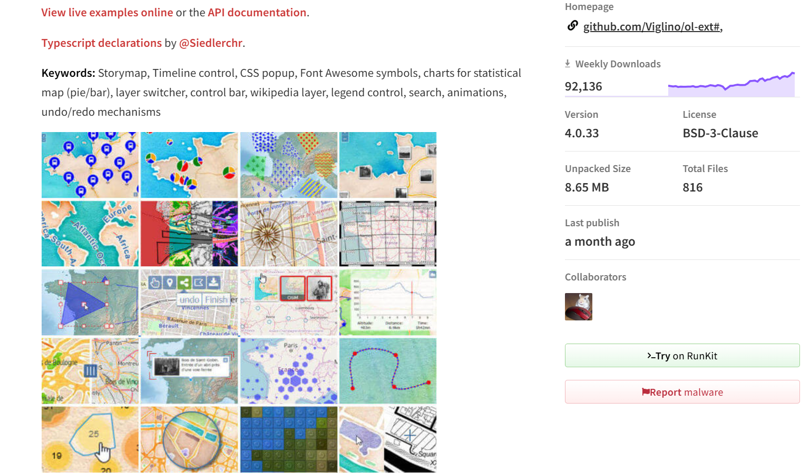

# ol-ext介绍

ol-ext是OpenLayers的一个扩展库，提供了很多增强功能

npm地址：[ol-ext](https://www.npmjs.com/package/ol-ext)

github地址：[ol-ext](https://github.com/Viglino/ol-ext)

文档地址：[ol-ext](http://viglino.github.io/ol-ext/doc/doc-pages/)

案例地址：[ol-ext](https://viglino.github.io/ol-ext/)

