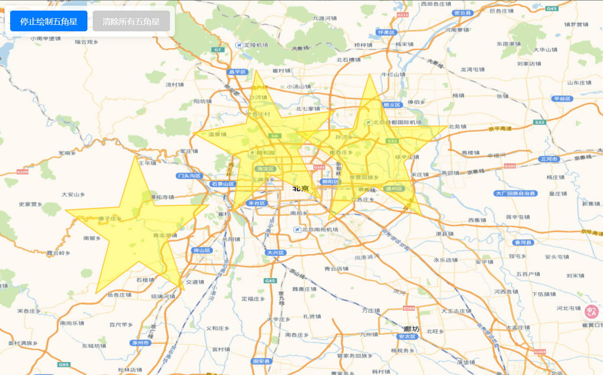

# 绘制自定义形状

## 介绍

1. 绘制自定义形状需要使用 `Draw` 交互，同时设置 `geometryFunction` 来自定义形状的几何函数。
2. 自定义形状的几何函数需要接收绘制的坐标数组和几何对象作为参数，返回一个新的几何对象。

:::details 展开代码

```vue
<template>
  <div class="map-container">
    <div ref="mapContainer" id="map"></div>
    <div class="controls">
      <button @click="toggleDrawInteraction">
        {{ isDrawing ? "停止绘制五角星" : "开始绘制五角星" }}
      </button>
      <button
        @click="clearFeatures"
        :disabled="!vectorSource || vectorSource.getFeatures().length === 0"
      >
        清除所有五角星
      </button>
    </div>
  </div>
</template>

<script setup>
import { ref, onMounted, onUnmounted } from "vue";
import Map from "ol/Map";
import View from "ol/View";
import TileLayer from "ol/layer/Tile";
import XYZ from "ol/source/XYZ";
import VectorLayer from "ol/layer/Vector";
import VectorSource from "ol/source/Vector";
import Draw from "ol/interaction/Draw";
import { Style, Fill, Stroke, Circle as CircleStyle } from "ol/style";
import Polygon from "ol/geom/Polygon";
import "ol/ol.css";

const mapContainer = ref(null);
let map = null;
let drawInteraction;
const vectorSource = new VectorSource();
const isDrawing = ref(false);

// 自定义五角星的几何函数
const starGeometryFunction = function (coordinates, geometry) {
  const center = coordinates[0]; // 绘制的起点 (圆心)
  const last = coordinates[coordinates.length - 1]; // 绘制的终点 (鼠标当前位置)
  const dx = center[0] - last[0];
  const dy = center[1] - last[1];
  const outerRadius = Math.sqrt(dx * dx + dy * dy); // 外圆半径
  const rotation = Math.atan2(dy, dx); // 鼠标相对于圆心的角度，用于旋转五角星

  const newCoordinates = [];
  const numPoints = 10; // 五角星有5个外顶点和5个内顶点，共10个点
  const innerRadiusFraction = 0.4; // 内圆半径与外圆半径的比例，可以调整这个值来改变五角星的尖锐程度

  for (let i = 0; i < numPoints; ++i) {
    // 计算每个点的角度
    const angle = rotation + (i * Math.PI * 2) / numPoints;
    // 根据点的索引决定使用外圆半径还是内圆半径
    const currentRadius = (i % 2 === 0 ? 1 : innerRadiusFraction) * outerRadius;

    const offsetX = currentRadius * Math.cos(angle);
    const offsetY = currentRadius * Math.sin(angle);
    newCoordinates.push([center[0] + offsetX, center[1] + offsetY]);
  }
  newCoordinates.push(newCoordinates[0].slice()); // 闭合多边形，使最后一个点连接到第一个点

  if (!geometry) {
    // 如果是第一次创建几何体
    geometry = new Polygon([newCoordinates]);
  } else {
    // 如果是更新几何体 (拖动过程中)
    geometry.setCoordinates([newCoordinates]);
  }
  return geometry;
};

// 设置绘制交互
const setupDrawInteraction = () => {
  drawInteraction = new Draw({
    source: vectorSource,
    type: "Circle",
    geometryFunction: starGeometryFunction, // 使用我们自定义的几何函数
    style: new Style({
      fill: new Fill({
        color: "rgba(255, 255, 0, 0.4)", // 绘制时的填充颜色 (黄色半透明)
      }),
      stroke: new Stroke({
        color: "#ffcc33", // 绘制时的边框颜色 (橙色)
        width: 2,
      }),
    }),
  });
};

// 切换绘制交互的激活状态
const toggleDrawInteraction = () => {
  if (isDrawing.value) {
    map.removeInteraction(drawInteraction);
    isDrawing.value = false;
  } else {
    if (!drawInteraction) {
      setupDrawInteraction(); // 如果尚未初始化，则进行初始化
    }
    map.addInteraction(drawInteraction);
    isDrawing.value = true;
  }
};

// 清除所有绘制的要素
const clearFeatures = () => {
  vectorSource.clear();
};

onMounted(() => {
  // 用于显示绘制要素的矢量图层
  const vectorLayer = new VectorLayer({
    source: vectorSource,
    style: new Style({
      fill: new Fill({
        color: "rgba(255, 255, 0, 0.4)", // 绘制完成后要素的填充颜色
      }),
      stroke: new Stroke({
        color: "#ffcc33", // 绘制完成后要素的边框颜色
        width: 2,
      }),
    }),
  });

  // 初始化地图，使用您提供的底图配置
  const view = new View({
    center: [116.4074, 39.9042], // 北京市中心经纬度
    zoom: 10,
    projection: "EPSG:4326", // 默认使用Web Mercator投影，需要设置为EPSG:4326经纬度
  });

  map = new Map({
    target: mapContainer.value,
    layers: [
      new TileLayer({
        source: new XYZ({
          // 设置路网图层
          url: "https://webrd04.is.autonavi.com/appmaptile?lang=zh_cn&size=1&scale=1&style=7&x={x}&y={y}&z={z}",
        }),
      }),
      vectorLayer, // 添加矢量图层
    ],
    view,
  });

  // 初始设置绘制交互，但默认不添加到地图上
  setupDrawInteraction();
});

onUnmounted(() => {
  // 组件卸载时清理地图和交互，防止内存泄漏
  if (map) {
    map.setTarget(undefined);
    map = null;
  }
  if (drawInteraction) {
    drawInteraction = null;
  }
});
</script>

<style scoped>
.map-container {
  width: 100vw;
  height: 100vh;
  position: relative;
  font-family: sans-serif;
}

#map {
  width: 100%;
  height: 100%;
  background: #f0f0f0; /* 地图背景色 */
}

.controls {
  position: absolute;
  top: 10px;
  left: 10px;
  z-index: 1000; /* 确保控件在地图之上 */
  display: flex;
  gap: 10px;
  background-color: rgba(255, 255, 255, 0.8);
  padding: 10px;
  border-radius: 8px;
  box-shadow: 0 2px 10px rgba(0, 0, 0, 0.1);
}

.controls button {
  padding: 10px 20px;
  background-color: #007bff;
  color: white;
  border: none;
  border-radius: 5px;
  cursor: pointer;
  font-size: 16px;
  transition: background-color 0.3s ease;
}

.controls button:hover {
  background-color: #0056b3;
}

.controls button:disabled {
  background-color: #cccccc;
  cursor: not-allowed;
}
</style>
```

:::


