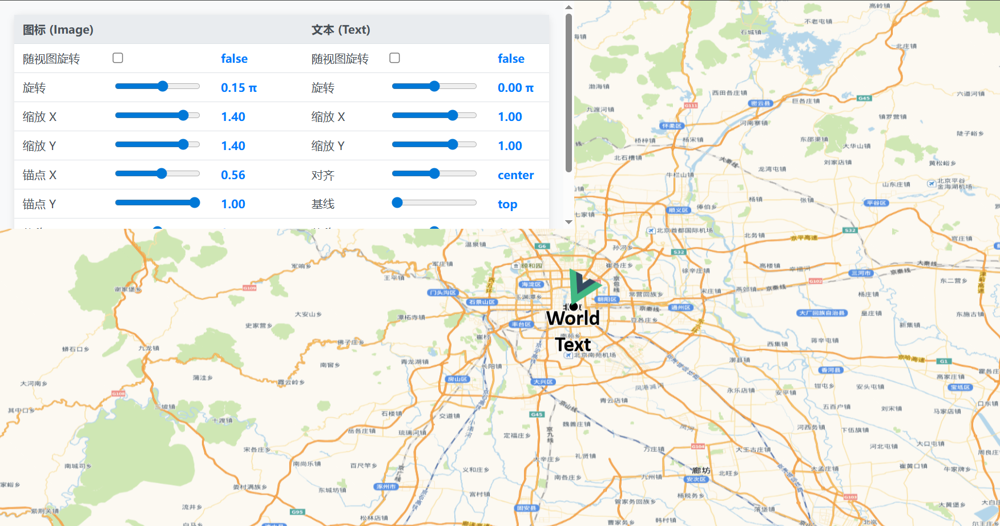

# Style属性调试

## 介绍

1. 该案例展示如何调试Style属性
2. 调试Style属性需要使用`Style`类的`get`方法获取属性值，使用`set`方法设置属性值。

:::details 展开代码

```vue
<template>
  <div class="map-container">
    <div ref="mapContainer" id="map"></div>

    <div class="controls-container">
      <table class="controls">
        <thead>
          <tr>
            <th>图标 (Image)</th>
            <th></th>
            <th></th>
            <th>&nbsp;&nbsp;&nbsp;&nbsp;</th>
            <th>文本 (Text)</th>
            <th></th>
            <th></th>
          </tr>
        </thead>
        <tbody>
          <tr>
            <td><label>随视图旋转</label></td>
            <td><input type="checkbox" v-model="controls.rotateWithView" @change="updateStyle" /></td>
            <td><span>{{ controls.rotateWithView }}</span></td>
            <td></td>
            <td><label>随视图旋转</label></td>
            <td><input type="checkbox" v-model="controls.textRotateWithView" @change="updateStyle" /></td>
            <td><span>{{ controls.textRotateWithView }}</span></td>
          </tr>
          <tr>
            <td><label>旋转</label></td>
            <td><input type="range" min="-1" max="1" step="0.05" v-model="controls.rotation" @input="updateStyle" />
            </td>
            <td><span>{{ parseFloat(controls.rotation).toFixed(2) }} π</span></td>
            <td></td>
            <td><label>旋转</label></td>
            <td><input type="range" min="-1" max="1" step="0.05" v-model="controls.textRotation" @input="updateStyle" />
            </td>
            <td><span>{{ parseFloat(controls.textRotation).toFixed(2) }} π</span></td>
          </tr>
          <tr>
            <td><label>缩放 X</label></td>
            <td><input type="range" min="-2" max="2" step="0.1" v-model="controls.scaleX" @input="updateStyle" /></td>
            <td><span>{{ parseFloat(controls.scaleX).toFixed(2) }}</span></td>
            <td></td>
            <td><label>缩放 X</label></td>
            <td><input type="range" min="-2" max="2" step="0.1" v-model="controls.textScaleX" @input="updateStyle" />
            </td>
            <td><span>{{ parseFloat(controls.textScaleX).toFixed(2) }}</span></td>
          </tr>
          <tr>
            <td><label>缩放 Y</label></td>
            <td><input type="range" min="-2" max="2" step="0.1" v-model="controls.scaleY" @input="updateStyle" /></td>
            <td><span>{{ parseFloat(controls.scaleY).toFixed(2) }}</span></td>
            <td></td>
            <td><label>缩放 Y</label></td>
            <td><input type="range" min="-2" max="2" step="0.1" v-model="controls.textScaleY" @input="updateStyle" />
            </td>
            <td><span>{{ parseFloat(controls.textScaleY).toFixed(2) }}</span></td>
          </tr>
          <tr>
            <td><label>锚点 X</label></td>
            <td><input type="range" min="0" max="1" step="0.01" v-model="controls.anchorX" @input="updateStyle" /></td>
            <td><span>{{ parseFloat(controls.anchorX).toFixed(2) }}</span></td>
            <td></td>
            <td><label>对齐</label></td>
            <td><input type="range" min="0" max="2" step="1" v-model="controls.textAlign" @input="updateStyle" /></td>
            <td><span>{{ textAlignments[parseInt(controls.textAlign)] }}</span></td>
          </tr>
          <tr>
            <td><label>锚点 Y</label></td>
            <td><input type="range" min="0" max="1" step="0.01" v-model="controls.anchorY" @input="updateStyle" /></td>
            <td><span>{{ parseFloat(controls.anchorY).toFixed(2) }}</span></td>
            <td></td>
            <td><label>基线</label></td>
            <td><input type="range" min="0" max="2" step="1" v-model="controls.textBaseline" @input="updateStyle" />
            </td>
            <td><span>{{ textBaselines[parseInt(controls.textBaseline)] }}</span></td>
          </tr>
          <tr>
            <td><label>位移 X</label></td>
            <td><input type="range" min="-100" max="100" v-model="controls.displacementX" @input="updateStyle" /></td>
            <td><span>{{ controls.displacementX }}</span></td>
            <td></td>
            <td><label>偏移 X</label></td>
            <td><input type="range" min="-100" max="100" v-model="controls.textOffsetX" @input="updateStyle" /></td>
            <td><span>{{ controls.textOffsetX }}</span></td>
          </tr>
          <tr>
            <td><label>位移 Y</label></td>
            <td><input type="range" min="-100" max="100" v-model="controls.displacementY" @input="updateStyle" /></td>
            <td><span>{{ controls.displacementY }}</span></td>
            <td></td>
            <td><label>偏移 Y</label></td>
            <td><input type="range" min="-100" max="100" v-model="controls.textOffsetY" @input="updateStyle" /></td>
            <td><span>{{ controls.textOffsetY }}</span></td>
          </tr>
        </tbody>
      </table>
    </div>
  </div>
</template>

<script setup>
import { ref, reactive, onMounted, onUnmounted } from 'vue';
import Map from 'ol/Map';
import View from 'ol/View';
import TileLayer from 'ol/layer/Tile';
import VectorLayer from 'ol/layer/Vector';
import VectorSource from 'ol/source/Vector';
import XYZ from 'ol/source/XYZ';
import Feature from 'ol/Feature';
import Point from 'ol/geom/Point';
import { Style, Icon, Text, Fill, Stroke, Circle } from 'ol/style';
import 'ol/ol.css';

const mapContainer = ref(null);
let map = null;
let iconFeature = null;
let iconStyle = null;
let pointStyle = null;

// 文本对齐和基线选项
const textAlignments = ['left', 'center', 'right'];
const textBaselines = ['top', 'middle', 'bottom'];

// 控制参数
const controls = reactive({
  rotation: 0.25,
  rotateWithView: false,
  scaleX: 1,
  scaleY: 1,
  anchorX: 0.5,
  anchorY: 1,
  displacementX: 0,
  displacementY: 0,
  textRotation: 0.25,
  textRotateWithView: false,
  textScaleX: 1,
  textScaleY: 1,
  textAlign: 1,
  textBaseline: 0,
  textOffsetX: 0,
  textOffsetY: 0,
});

// 更新样式函数
const updateStyle = () => {
  if (!iconStyle) return;

  // 更新图标样式
  iconStyle.getImage().setRotation(parseFloat(controls.rotation) * Math.PI);
  iconStyle.getImage().setRotateWithView(controls.rotateWithView);
  iconStyle.getImage().setScale([
    parseFloat(controls.scaleX),
    parseFloat(controls.scaleY),
  ]);
  iconStyle.getImage().setAnchor([
    parseFloat(controls.anchorX),
    parseFloat(controls.anchorY),
  ]);
  iconStyle.getImage().setDisplacement([
    parseFloat(controls.displacementX),
    parseFloat(controls.displacementY),
  ]);

  // 更新文本样式
  iconStyle.getText().setRotation(parseFloat(controls.textRotation) * Math.PI);
  iconStyle.getText().setRotateWithView(controls.textRotateWithView);
  iconStyle.getText().setScale([
    parseFloat(controls.textScaleX),
    parseFloat(controls.textScaleY),
  ]);
  iconStyle.getText().setTextAlign(textAlignments[parseInt(controls.textAlign)]);
  iconStyle.getText().setTextBaseline(textBaselines[parseInt(controls.textBaseline)]);
  iconStyle.getText().setOffsetX(parseFloat(controls.textOffsetX));
  iconStyle.getText().setOffsetY(parseFloat(controls.textOffsetY));

  // 触发要素重新渲染
  iconFeature.changed();
};

onMounted(() => {
  // 创建图标要素
  iconFeature = new Feature({
    geometry: new Point([116.4074, 39.9042]), // 使用北京坐标
  });

  // 创建图标样式
  iconStyle = new Style({
    image: new Icon({
      anchor: [0.5, 1],
      src: '/src/assets/vue.svg',
    }),
    text: new Text({
      text: 'World\nText',
      font: 'bold 30px Calibri,sans-serif',
      fill: new Fill({
        color: 'black',
      }),
      stroke: new Stroke({
        color: 'white',
        width: 2,
      }),
    }),
  });

  // 创建点样式
  pointStyle = new Style({
    image: new Circle({
      radius: 7,
      fill: new Fill({
        color: 'black',
      }),
      stroke: new Stroke({
        color: 'white',
        width: 2,
      }),
    }),
  });

  // 设置要素样式
  iconFeature.setStyle([pointStyle, iconStyle]);

  // 创建矢量数据源和图层
  const vectorSource = new VectorSource({
    features: [iconFeature],
  });

  const vectorLayer = new VectorLayer({
    source: vectorSource,
  });

  // 创建瓦片图层
  const tileLayer = new TileLayer({
    source: new XYZ({
      url: "https://webrd04.is.autonavi.com/appmaptile?lang=zh_cn&size=1&scale=1&style=7&x={x}&y={y}&z={z}",
    }),
  });

  // 创建视图
  const view = new View({
    center: [116.4074, 39.9042], // 北京市中心经纬度
    zoom: 10,
    projection: "EPSG:4326",
  });

  // 初始化地图
  map = new Map({
    target: mapContainer.value,
    layers: [tileLayer, vectorLayer],
    view,
  });

  // 添加鼠标悬停效果
  map.on('pointermove', (e) => {
    const hit = map.hasFeatureAtPixel(e.pixel);
    map.getTargetElement().style.cursor = hit ? 'pointer' : '';
  });

  // 初始化样式
  updateStyle();
});

onUnmounted(() => {
  if (map) {
    map.setTarget(undefined);
    map = null;
  }
});
</script>

<style scoped>
.map-container {
  width: 100vw;
  height: 100vh;
  position: relative;
  font-family: sans-serif;
  overflow: hidden;
}

#map {
  width: 100%;
  height: 100vh;
}

.controls-container {
  position: absolute;
  top: 0;
  height: 38vh;
  overflow-y: auto;
  background-color: #f8f9fa;
  padding: 20px;
}

.controls {
  width: 100%;
  border-collapse: collapse;
  background-color: white;
  border-radius: 8px;
  box-shadow: 0 2px 10px rgba(0, 0, 0, 0.1);
}

.controls th,
.controls td {
  padding: 8px 12px;
  text-align: left;
  border-bottom: 1px solid #dee2e6;
}

.controls th {
  background-color: #e9ecef;
  font-weight: bold;
  color: #495057;
}

.controls label {
  font-weight: 500;
  color: #495057;
  white-space: nowrap;
}

.controls input[type="range"] {
  width: 120px;
  margin: 0 5px;
}

.controls input[type="checkbox"] {
  transform: scale(1.2);
}

.controls span {
  font-weight: bold;
  color: #007bff;
  min-width: 60px;
  display: inline-block;
}

.controls tr:hover {
  background-color: #f8f9fa;
}
</style>
```

:::


