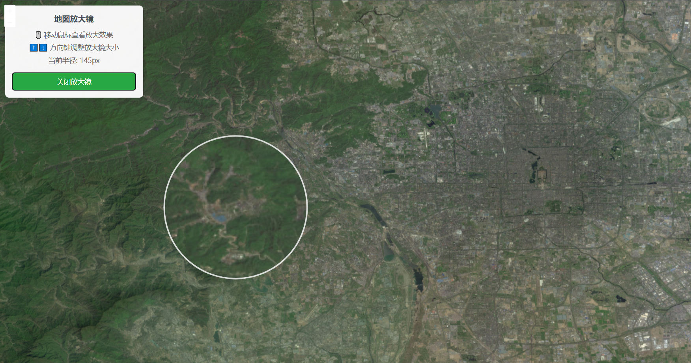

# 图层放大

## 介绍

1. 使用 `↑` 向上和 `↓` 向下箭头键调整望远镜大小。
2. 利用`postrender`事件侦听器在指针位置周围的圆圈中对图像进行过采样。此事件的侦听器可以访问 Canvas 上下文，并可以作图像数据。
3. 注意高德底图跨域配置，`crossOrigin: 'anonymous'`。

:::details 展开代码

```vue
<template>
  <div class="map-container">
    <div ref="mapContainer" id="map"></div>
    <div class="controls">
      <div class="info">
        <h4>地图放大镜</h4>
        <p>🖱️ 移动鼠标查看放大效果</p>
        <p>⬆️⬇️ 方向键调整放大镜大小</p>
        <p>当前半径: {{ radius }}px</p>
      </div>
      <button @click="toggleMagnify">
        {{ isMagnifyEnabled ? "关闭放大镜" : "开启放大镜" }}
      </button>
    </div>
  </div>
</template>

<script setup>
import { ref, onMounted, onUnmounted } from "vue";
import Map from "ol/Map";
import View from "ol/View";
import TileLayer from "ol/layer/Tile";
import XYZ from "ol/source/XYZ";
import { getRenderPixel } from "ol/render";
import "ol/ol.css";

const mapContainer = ref(null);
let map = null;
let imageryLayer = null;
let mousePosition = null;

// 响应式变量
const radius = ref(75);
const isMagnifyEnabled = ref(true);

// 后渲染事件处理函数 - 实现放大镜效果
const handlePostrender = (event) => {
  if (!isMagnifyEnabled.value || !mousePosition) return;

  const pixel = getRenderPixel(event, mousePosition);
  const offset = getRenderPixel(event, [
    mousePosition[0] + radius.value,
    mousePosition[1],
  ]);
  const half = Math.sqrt(
    Math.pow(offset[0] - pixel[0], 2) + Math.pow(offset[1] - pixel[1], 2)
  );

  const context = event.context;
  const centerX = pixel[0];
  const centerY = pixel[1];
  const originX = centerX - half;
  const originY = centerY - half;
  const size = Math.round(2 * half + 1);

  try {
    // 获取原始图像数据
    const sourceData = context.getImageData(originX, originY, size, size).data;
    const dest = context.createImageData(size, size);
    const destData = dest.data;

    // 创建放大效果
    for (let j = 0; j < size; ++j) {
      for (let i = 0; i < size; ++i) {
        const dI = i - half;
        const dJ = j - half;
        const dist = Math.sqrt(dI * dI + dJ * dJ);
        let sourceI = i;
        let sourceJ = j;

        if (dist < half) {
          // 在圆形区域内，使用放大效果（2倍放大）
          sourceI = Math.round(half + dI / 2);
          sourceJ = Math.round(half + dJ / 2);
        }

        const destOffset = (j * size + i) * 4;
        const sourceOffset = (sourceJ * size + sourceI) * 4;

        // 复制像素数据
        destData[destOffset] = sourceData[sourceOffset]; // R
        destData[destOffset + 1] = sourceData[sourceOffset + 1]; // G
        destData[destOffset + 2] = sourceData[sourceOffset + 2]; // B
        destData[destOffset + 3] = sourceData[sourceOffset + 3]; // A
      }
    }

    // 绘制放大镜边框
    context.beginPath();
    context.arc(centerX, centerY, half, 0, 2 * Math.PI);
    context.lineWidth = (3 * half) / radius.value;
    context.strokeStyle = "rgba(255,255,255,0.8)";

    // 应用放大后的图像数据
    context.putImageData(dest, originX, originY);
    context.stroke();
  } catch (error) {
    console.warn("放大镜渲染出错:", error);
  }
};

// 鼠标移动事件处理
const handleMouseMove = (event) => {
  if (!isMagnifyEnabled.value) return;

  mousePosition = map.getEventPixel(event);
  map.render();
};

// 鼠标离开事件处理
const handleMouseOut = () => {
  mousePosition = null;
  map.render();
};

// 键盘事件处理
const handleKeyDown = (event) => {
  if (!isMagnifyEnabled.value) return;

  if (event.key === "ArrowUp") {
    radius.value = Math.min(radius.value + 5, 150);
    map.render();
    event.preventDefault();
  } else if (event.key === "ArrowDown") {
    radius.value = Math.max(radius.value - 5, 25);
    map.render();
    event.preventDefault();
  }
};

// 切换放大镜功能
const toggleMagnify = () => {
  isMagnifyEnabled.value = !isMagnifyEnabled.value;

  // 清除事件监听器
  imageryLayer.un("postrender", handlePostrender);

  if (isMagnifyEnabled.value) {
    // 重新添加事件监听器
    imageryLayer.on("postrender", handlePostrender);
  } else {
    mousePosition = null;
  }

  map.render();
};

onMounted(() => {
  // 创建卫星图层
  imageryLayer = new TileLayer({
    source: new XYZ({
      url: "https://webst01.is.autonavi.com/appmaptile?style=6&x={x}&y={y}&z={z}",
      crossOrigin: "anonymous", // 添加跨域设置
    }),
  });

  // 创建视图
  const view = new View({
    center: [116.4074, 39.9042], // 北京市中心经纬度
    zoom: 10,
    projection: "EPSG:4326",
  });

  // 初始化地图
  map = new Map({
    target: mapContainer.value,
    layers: [imageryLayer],
    view,
  });

  // 添加事件监听器
  const container = mapContainer.value;
  container.addEventListener("mousemove", handleMouseMove);
  container.addEventListener("mouseout", handleMouseOut);
  document.addEventListener("keydown", handleKeyDown);

  // 初始化放大镜效果
  if (isMagnifyEnabled.value) {
    imageryLayer.on("postrender", handlePostrender);
  }
});

onUnmounted(() => {
  // 清理事件监听器
  if (mapContainer.value) {
    mapContainer.value.removeEventListener("mousemove", handleMouseMove);
    mapContainer.value.removeEventListener("mouseout", handleMouseOut);
  }
  document.removeEventListener("keydown", handleKeyDown);

  // 清理图层事件
  if (imageryLayer) {
    imageryLayer.un("postrender", handlePostrender);
  }

  if (map) {
    map.setTarget(undefined);
    map = null;
  }
});
</script>

<style scoped>
.map-container {
  width: 100vw;
  height: 100vh;
  position: relative;
  font-family: sans-serif;
}

#map {
  width: 100%;
  height: 100%;
  cursor: crosshair;
}

.controls {
  position: absolute;
  top: 10px;
  left: 10px;
  z-index: 1000;
  background-color: rgba(255, 255, 255, 0.95);
  padding: 15px;
  border-radius: 8px;
  box-shadow: 0 2px 10px rgba(0, 0, 0, 0.1);
  min-width: 250px;
}

.info h4 {
  margin: 0 0 10px 0;
  color: #495057;
  font-size: 16px;
}

.info p {
  margin: 5px 0;
  font-size: 14px;
  color: #666;
}

.controls button {
  width: 100%;
  padding: 8px 16px;
  background-color: #28a745;
  color: white;
  border: none;
  border-radius: 5px;
  cursor: pointer;
  font-size: 14px;
  transition: background-color 0.3s ease;
  margin-top: 10px;
}

.controls button:hover {
  background-color: #218838;
}
</style>
```

:::

