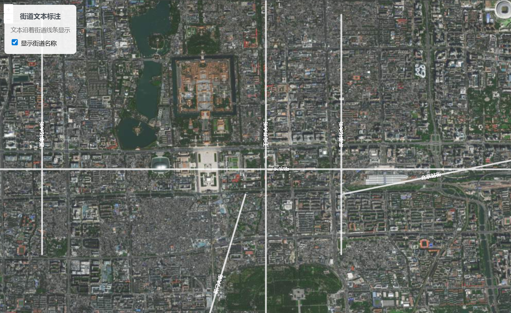

# 沿线文本

## 介绍

1. 设置`placement`为`line`，文本会沿着街道线条显示
2. `placement`可取`line`、`point`、默认`point`

:::details 展开代码

```vue
<template>
  <div class="map-container">
    <div ref="mapContainer" id="map"></div>
    <div class="controls">
      <div class="info">
        <h4>街道文本标注</h4>
        <p>文本沿着街道线条显示</p>
      </div>
      <div class="control-group">
        <label>
          <input
            type="checkbox"
            v-model="showStreetNames"
            @change="toggleStreetNames"
          />
          显示街道名称
        </label>
      </div>
    </div>
  </div>
</template>

<script setup>
import { ref, onMounted, onUnmounted } from "vue";
import Map from "ol/Map";
import View from "ol/View";
import TileLayer from "ol/layer/Tile";
import VectorLayer from "ol/layer/Vector";
import VectorSource from "ol/source/Vector";
import XYZ from "ol/source/XYZ";
import Feature from "ol/Feature";
import LineString from "ol/geom/LineString";
import { Style, Fill, Stroke, Text } from "ol/style";
import "ol/ol.css";

const mapContainer = ref(null);
let map = null;
let vectorLayer = null;

// 响应式变量
const showStreetNames = ref(true);

// 街道文本样式
const streetTextStyle = new Style({
  stroke: new Stroke({
    color: "rgba(255, 255, 255, 0.8)",
    width: 4,
  }),
  text: new Text({
    font: 'bold 12px "Arial", sans-serif',
    placement: "line", // 关键：沿线显示文本
    fill: new Fill({
      color: "white",
    }),
    stroke: new Stroke({
      color: "rgba(0, 0, 0, 0.8)",
      width: 2,
    }),
  }),
});

// 样式函数
const styleFunction = (feature) => {
  console.log(showStreetNames.value);
  const streetName = feature.get("name");
  streetTextStyle.getText().setText(streetName);
  streetTextStyle
    .getText()
    .setPlacement(showStreetNames.value ? "line" : "point");
  return streetTextStyle;
};

// 切换街道名称显示
const toggleStreetNames = () => {
  vectorLayer.changed();
};

onMounted(() => {
  // 创建底图
  const baseLayer = new TileLayer({
    source: new XYZ({
      url: "https://webst01.is.autonavi.com/appmaptile?style=6&x={x}&y={y}&z={z}",
    }),
  });

  // 创建模拟街道数据
  const streetFeatures = [
    {
      name: "长安街",
      coordinates: [
        [116.35, 39.9042],
        [116.38, 39.9042],
        [116.41, 39.9042],
        [116.44, 39.9042],
        [116.47, 39.9042],
      ],
    },
    {
      name: "王府井大街",
      coordinates: [
        [116.4074, 39.88],
        [116.4074, 39.9],
        [116.4074, 39.92],
        [116.4074, 39.94],
      ],
    },
    {
      name: "西单北大街",
      coordinates: [
        [116.37, 39.89],
        [116.37, 39.91],
        [116.37, 39.93],
      ],
    },
    {
      name: "东单北大街",
      coordinates: [
        [116.42, 39.89],
        [116.42, 39.91],
        [116.42, 39.93],
      ],
    },
    {
      name: "前门大街",
      coordinates: [
        [116.395, 39.87],
        [116.398, 39.88],
        [116.401, 39.89],
        [116.404, 39.9],
      ],
    },
    {
      name: "北京站街",
      coordinates: [
        [116.42, 39.9],
        [116.43, 39.902],
        [116.44, 39.904],
        [116.45, 39.906],
      ],
    },
  ];

  // 创建街道要素
  const features = streetFeatures.map((street) => {
    const feature = new Feature({
      geometry: new LineString(street.coordinates),
      name: street.name,
    });
    return feature;
  });

  // 创建矢量图层
  vectorLayer = new VectorLayer({
    source: new VectorSource({ features }),
    style: styleFunction,
    declutter: true, // 启用标签碰撞检测
  });

  // 创建地图
  map = new Map({
    target: mapContainer.value,
    layers: [baseLayer, vectorLayer],
    view: new View({
      center: [116.4074, 39.9042],
      zoom: 14,
      projection: "EPSG:4326",
    }),
  });
});

onUnmounted(() => {
  if (map) {
    map.setTarget(undefined);
    map = null;
  }
});
</script>

<style scoped>
.map-container {
  width: 100vw;
  height: 100vh;
  position: relative;
  font-family: sans-serif;
}

#map {
  width: 100%;
  height: 100%;
}

.controls {
  position: absolute;
  top: 10px;
  left: 10px;
  z-index: 1000;
  background-color: rgba(255, 255, 255, 0.9);
  padding: 15px;
  border-radius: 8px;
  box-shadow: 0 2px 10px rgba(0, 0, 0, 0.1);
}

.info h4 {
  margin: 0 0 10px 0;
  color: #495057;
  font-size: 16px;
}

.info p {
  margin: 5px 0;
  font-size: 14px;
  color: #666;
}

.control-group {
  display: flex;
  align-items: center;
  gap: 10px;
  font-size: 14px;
  margin-top: 10px;
}

.control-group input[type="checkbox"] {
  transform: scale(1.2);
}
</style>
```

:::

### 沿线文本



### 默认文本


