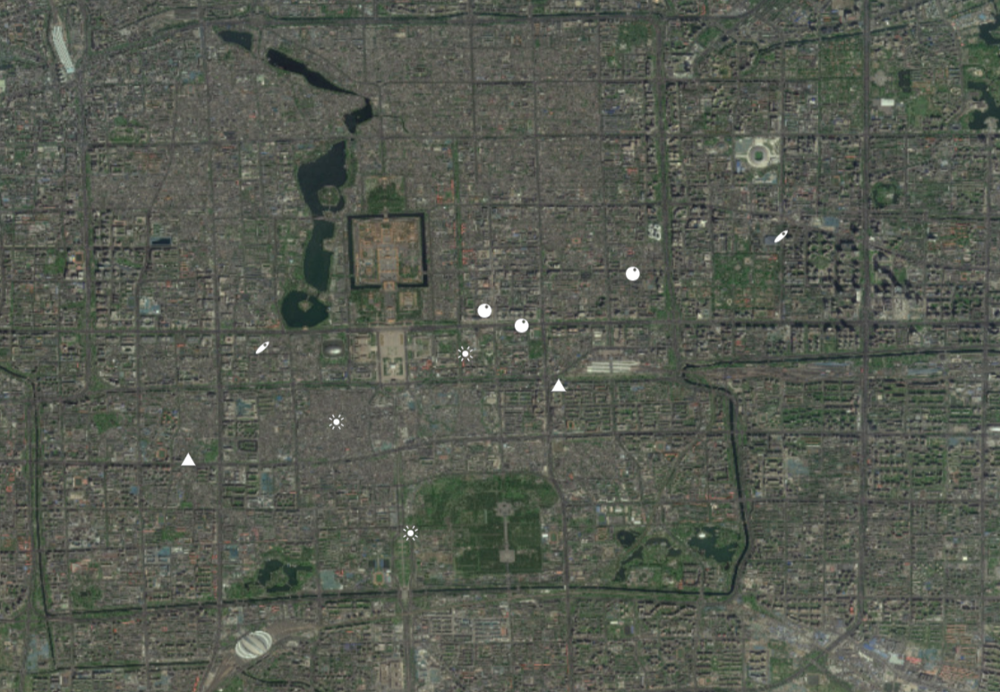

# 精灵图

## 介绍

1. 注意你的图片大小，这里图片是 128\*64 的，所以`icon-width`和`icon-height`要写 128 和 64
2. `icon-offset`是图标偏移量，对`type`进行匹配，**如果都没有匹配到，就取最后一个值，这里是[96, 32]，类似于 switch 语句**

核心代码：

```bash
style: {
      "icon-src": "/src/openlayers/assets/ufo_shapes.png", // 精灵图路径
      "icon-width": 128, // 精灵图总宽度
      "icon-height": 64, // 精灵图总高度
      "icon-size": [32, 32], // 单个图标大小
      "icon-scale": 0.5, // 缩放图标以适应地图
      "icon-offset": [
        "match",
        ["get", "type"],
        "restaurant",
        [0, 0],
        "hotel",
        [32, 0],
        "shop",
        [64, 0],
        "hospital",
        [96, 0],
        [96, 32], // 默认位置
      ],
    },
```

:::details 展开代码

```vue
<template>
  <div class="map-container">
    <div ref="mapContainer" id="map"></div>
  </div>
</template>

<script setup>
import { ref, onMounted, onUnmounted } from "vue";
import Map from "ol/Map";
import View from "ol/View";
import TileLayer from "ol/layer/Tile";
import WebGLVectorLayer from "ol/layer/WebGLVector";
import VectorSource from "ol/source/Vector";
import XYZ from "ol/source/XYZ";
import Feature from "ol/Feature";
import Point from "ol/geom/Point";
import "ol/ol.css";

const mapContainer = ref(null);
let map = null;

// 模拟地点数据
const generatePlaces = () => {
  const places = [
    { name: "北京烤鸭店", type: "restaurant", coords: [116.4074, 39.9042] },
    { name: "王府井酒店", type: "hotel", coords: [116.41, 39.91] },
    { name: "西单商场", type: "shop", coords: [116.38, 39.905] },
    { name: "协和医院", type: "hospital", coords: [116.42, 39.9] },
    { name: "海底捞火锅", type: "restaurant", coords: [116.39, 39.895] },
    { name: "香格里拉酒店", type: "hotel", coords: [116.43, 39.915] },
    { name: "三里屯商店", type: "shop", coords: [116.45, 39.92] },
    { name: "北京医院", type: "hospital", coords: [116.37, 39.89] },
    { name: "全聚德", type: "restaurant", coords: [116.4, 39.88] },
    { name: "北京饭店", type: "hotel", coords: [116.415, 39.908] },
  ];

  return places.map((place, index) => {
    const feature = new Feature({
      geometry: new Point(place.coords),
      name: place.name,
      type: place.type,
      id: index,
    });
    return feature;
  });
};

onMounted(() => {
  // 创建矢量数据源
  const vectorSource = new VectorSource();

  // 添加地点要素
  const features = generatePlaces();
  vectorSource.addFeatures(features);

  // 创建WebGL图层使用精灵图
  const webglLayer = new WebGLVectorLayer({
    source: vectorSource,
    style: {
      "icon-src": "/src/openlayers/assets/ufo_shapes.png", // 精灵图路径
      "icon-width": 128, // 精灵图总宽度
      "icon-height": 64, // 精灵图总高度
      "icon-size": [32, 32], // 单个图标大小
      "icon-scale": 0.5, // 缩放图标以适应地图
      "icon-offset": [
        "match",
        ["get", "type"],
        "restaurant",
        [0, 0],
        "hotel",
        [32, 0],
        "shop",
        [64, 0],
        "hospital",
        [96, 0],
        [96, 32], // 默认位置
      ],
    },
  });

  // 创建地图
  map = new Map({
    target: mapContainer.value,
    layers: [
      new TileLayer({
        source: new XYZ({
          url: "https://webst01.is.autonavi.com/appmaptile?style=6&x={x}&y={y}&z={z}",
        }),
      }),
      webglLayer,
    ],
    view: new View({
      center: [116.4074, 39.9042],
      zoom: 12,
      projection: "EPSG:4326",
    }),
  });

  // 点击事件显示信息
  map.on("click", (evt) => {
    const features = map.getFeaturesAtPixel(evt.pixel);
    if (features.length > 0) {
      const feature = features[0];
      const name = feature.get("name");
      const type = feature.get("type");
      alert(`${name} (${type})`);
    }
  });
});

onUnmounted(() => {
  if (map) {
    map.setTarget(undefined);
    map = null;
  }
});
</script>

<style scoped>
.map-container {
  width: 100vw;
  height: 100vh;
  position: relative;
  font-family: sans-serif;
}

#map {
  width: 100%;
  height: 100%;
}
</style>
```

:::

### 原图


### 效果图


